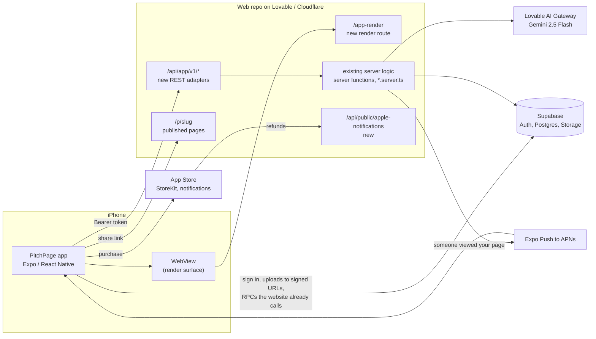

# PitchPage for iOS: master plan

| | |
|---|---|
| **Status** | In build. Part C is on hold — see the constraint below. |
| **App repo** | `ridoy-pitchpage/pitchpage-app-ios` (this repo) |
| **Web + backend repo** | `gregadosmond-oss/profile-pride-app` (pitchpage.co) — **read-only** |
| **Stack** | Expo SDK 57, React Native 0.86, TypeScript, Expo Router |
| **Payments** | None in the app since 9 Oct 2026: publishing from it is free (§13). Credits and Stripe stay on the website. |
| **Source of facts** | A full read-through of the web repo on 30 Sep 2026: every route, all 144 server functions, the migrations, storage and auth |

---

> ## Standing constraint: the web repo is read-only
>
> **Set 30 Sep 2026 by the owner.** Nothing in
> `gregadosmond-oss/profile-pride-app` is to be changed. It is a reference only.
>
> **Corrected 30 Sep 2026, after checking the database instead of reasoning
> about it.** Two things listed here as blocked were not.
>
> *Analytics was not blocked.* `pitch_page_views` carries an RLS policy —
> "Owners can read their pages' view events" — so the signed-in user's own
> client reads the same rows the website's server function reads, and
> `get_page_analytics_rollup` is SECURITY INVOKER granted to `authenticated`.
> The aggregation is pure TypeScript. Analytics is built, in `src/analytics/`
> and `app/(app)/(tabs)/analytics/`.
>
> *Account deletion needed new SQL, which is not the same as changing the
> website repo.* That repo's migrations never auto-apply — its own files say to
> paste them into Lovable's SQL editor by hand — so the deletion function lives
> in this repo at `sql/001_delete_my_account.sql` and is applied the same way.
> The website repo is untouched. Until somebody runs it, the app falls back to
> the emailed request; running it is what clears the App Store blocker.
>
> **Part C of this plan is still on hold**: no app API, no universal-links
> file, no Apple purchase endpoint, no push tokens. It stays written down as
> the plan for when that changes. The one exception is the render surface:
> `/app-render`, approved by the owner and merged on 2026-10-06
> (gregadosmond-oss/profile-pride-app#262). It is live once someone publishes
> in Lovable; until then the app falls back to drawing pages itself.
>
> **What the app does, using only what the website already exposes:**
>
> - Sign in, and stay signed in, through Supabase Auth.
> - Read and write the user's own pages — row-level security already grants a
>   signed-in account exactly that.
> - Publish and unpublish, through database functions any signed-in user may
>   call. Publishing from the app is free, for up to 3 live pages, inside
>   `publish_pitch_page_from_app` (live 9 Oct 2026, §13).
> - Create, copy and remove tracked links.
> - Read a page's analytics, and count them the same way the website does.
> - Show a published page by loading `pitchpage.co/p/<slug>` in a web view.
> - Upload a portrait, video, résumé or document into the user's own storage
>   folder.
> - Delete the account outright: `sql/001_delete_my_account.sql` was applied
>   and tested end to end on 2026-10-06.
>
> **What it cannot do, each checked against the grants rather than assumed:**
>
> | Blocked | Why | What happens instead |
> |---|---|---|
> | Buying credits in the app | `grant_credits` is `service_role` only and explicitly revoked from `authenticated` — correctly, since a client that could grant itself credits would be a hole. Apple's receipt has to be verified server-side first. | Nothing is sold in the app (9 Oct 2026, §13). Publishing from it is free, and credits are bought and spent only on the website |
> | Push notifications | Needs a device-token table and a sender | Visitor alerts stay email and web push |
> | AI — building from a résumé, Paige, style suggestions, gap questions | Server code behind an API key the app must not hold | The app edits by hand; AI steps stay on the website |
> | Outreach sequences and sends | Sending email is server work | Stays on the website |
> | ~~A pixel-exact preview of a *draft*~~ | Unblocked 2026-10-06: `/app-render` draws a draft with the website's own layouts (web PR #262) | The builder uses it once it is published in Lovable, and draws pages itself until then |
>
> **Not blocked, but not built.** The company/organization dashboard
> (`get_org_analytics`, `get_org_outcomes`, `get_org_tracked_links` and the
> rest) is SECURITY DEFINER granted to `authenticated`, checks `_is_org_admin`
> itself, and so *is* callable from the app. It is a large surface for a small
> group of admins, and is deliberately left for after 1.0 rather than
> misreported as impossible.

---

## Contents

**Part A: What we're building**
1. [Summary](#1-summary)
2. [Goals and non-goals](#2-goals-and-non-goals)
3. [Key decisions](#3-key-decisions)
4. [How it fits together](#4-how-it-fits-together)

**Part B: Every screen**

5. [Navigation](#5-navigation)
6. [Screen inventory (117 screens)](#6-screen-inventory)
7. [Web coverage: every web route and where it goes](#7-web-coverage)

**Part C: Backend work in the web repo**

8. [Ground rules](#8-ground-rules-for-the-web-repo)
9. [The app API](#9-the-app-api)
10. [New backend pieces](#10-new-backend-pieces)
11. [Database changes](#11-database-changes)

**Part D: How the hard parts work**

12. [Sign-in and sessions](#12-sign-in-and-sessions)
13. [Credits and In-App Purchase](#13-credits-and-in-app-purchase)
14. [Page rendering and previews](#14-page-rendering-and-previews)
15. [Media: documents, photos, video](#15-media-documents-photos-video)
16. [Paige](#16-paige)
17. [Notifications](#17-notifications)
18. [Product analytics and crash reporting](#18-product-analytics-and-crash-reporting)
19. [Design system](#19-design-system)
20. [Errors, offline and copy](#20-errors-offline-and-copy)
21. [Security and privacy](#21-security-and-privacy)

**Part E: Engineering**

22. [Libraries](#22-libraries)
23. [Repo layout](#23-repo-layout)
24. [Environments and config](#24-environments-and-config)
25. [Your setup: Windows PC and Mac](#25-your-setup-windows-pc-and-mac)
26. [Testing](#26-testing)
27. [CI/CD and releases](#27-cicd-and-releases)

**Part F: App Store**

28. [Accounts and agreements](#28-accounts-and-agreements)
29. [Submission checklist](#29-submission-checklist)
30. [Review risks](#30-review-risks)

**Part G: Delivery**

31. [Spikes (answer these first)](#31-spikes)
32. [Milestones](#32-milestones)
33. [Risks](#33-risks)
34. [Decisions needed](#34-decisions-needed)
35. [Next steps](#35-next-steps)

**Appendices**

- [A. Endpoint map for company, outreach and admin](#appendix-a-endpoint-map-for-company-outreach-and-admin)
- [B. Facts from the web audit](#appendix-b-facts-from-the-web-audit)
- [C. Web issues found during the audit](#appendix-c-web-issues-found-during-the-audit)

---

# Part A: What we're building

## 1. Summary

We're building a native iPhone app that covers everything a signed-in user can do on pitchpage.co:
- build pages with AI and Paige;
- publish and share them;
- see who viewed them;
- buy credits;
- run a company roster;
- manage outreach.

It also adds what a phone does better: camera and video recording, the iOS share sheet, push notifications when someone views your page, and Sign in with Apple.

Three rules shape the plan:

1. **One backend.** The app uses the website's Supabase database, accounts and credit balance.
   - Every business rule stays in the web repo's server code: credits, publishing, company permissions and AI limits.
   - The app reaches those rules through a new, stable REST API.
2. **One renderer.** Published pages stay at `pitchpage.co/p/<slug>`.
   - The app draws its previews with the website's own page renderer (40 layouts) inside a WebView.
   - So what you see in the app is exactly what a recruiter sees.
3. **App Store rules first.**
   - Credits bought in the app go through Apple In-App Purchase.
   - Accounts can be deleted inside the app.
   - Users agree before their résumé is sent to the AI provider.

**Size of the job**
- 117 app screens (§6), covering all 55 web page routes (§7).
- 119 existing server functions get an app API endpoint now, and 5 voice functions get one later. The other 20 are visitor-side, web-only or unused.
- About 15 new endpoints and routes.
- 2 new tables and 1 new column.
- 10 milestones. The full consumer app (v1.0) is done at milestone 7. Company, outreach and admin follow as updates.

## 2. Goals and non-goals

**Goals**
- Parity with the signed-in website. Every screen in §6 works against the live backend.
- A native feel: camera, video, files, the share sheet, push, haptics, dark mode, Dynamic Type and VoiceOver.
- A browser preview on your Windows PC from week one. Native features are tested on the Mac and an iPhone.
- Approval from App Review on the first or second submission.

**Not in scope, and why**

| Out of scope | Why |
|---|---|
| Rebuilding the 40 page layouts natively | The web renderer is reused (§14), so previews can't drift from the live page |
| The visitor side of `/p/<slug>` | Recruiters open pages in a browser; that doesn't change |
| Native versions of marketing and SEO pages | They open in an in-app browser. The app gets native Welcome, Examples, Pricing, FAQ, Guides and Help screens instead. |
| Features the website hasn't switched on: voice coach, visitor voice guide, outreach sending | Each gets a slot behind a flag (`/config`) and turns on when the website does |
| Android and an iPad-specific layout | These are later work. Expo can build Android from the same code, but that needs Google Play Billing. |

## 3. Key decisions

| # | Decision | Why |
|---|---|---|
| D1 | **Expo SDK 57 + React Native 0.86 + TypeScript + Expo Router** | Gives a browser preview on Windows and iOS builds in the cloud (EAS) without a Mac. It uses the same React and TypeScript as the website, and its file-based routes work like TanStack Router's. |
| D2 | **Development builds from M2 onward** (Expo Go is enough for M0–M1) | In-App Purchase, native Sign in with Apple and our video module need native code that Expo Go doesn't include |
| D3 | **A new REST API in the web repo, `/api/app/v1/*`, made of thin adapters over the existing server functions** | Server functions use build-generated IDs and a private wire format, so a native app can't call them reliably. Adapters keep a single copy of every business rule. |
| D4 | **Page previews through a new web "render surface" (`/app-render`), shown in a WebView** | Previews are pixel-identical to the live page. We don't duplicate 40 layouts × 20 colours × light/dark. |
| D5 | **Credits as StoreKit consumables** (1 credit and 5 credits), verified on our server and granted with the existing `grant_credits` RPC | App Store Guideline 3.1.1 requires it, and the balance stays shared between web and app. No credits RPC needs to change (§13). |
| D6 | **Supabase Auth with the same accounts.** Email and password go direct to Supabase; spike S1 decides how Apple and Google sign-in work. | Google and Apple sign-in currently run through Lovable's OAuth broker, so the native options have to be proven on this project first |
| D7 | **Push notifications through Expo Push Service** (APNs underneath) | It's a plain HTTPS JSON API, which works from Cloudflare Workers. Calling APNs directly needs HTTP/2 client support we would have to prove first. |
| D8 | **NativeWind (Tailwind classes) + one tokens file ported from the web themes** | Same styling vocabulary as the website, and colours are defined in one place |
| D9 | **TanStack Query + a typed client built from a contract file the web repo publishes** | Same caching model as the website, and the app stops compiling when the API changes shape |
| D10 | **PostHog (same project, same event names) + Sentry for crashes** | Funnels stay comparable across web and app |

## 4. How it fits together



- **App → Supabase:**
  - sign-in and session refresh;
  - uploads to signed URLs;
  - the few RPCs the website already calls straight from the browser (§9.3).
- **App → `/api/app/v1`:** everything else: pages, AI, Paige, analytics, credits, company, outreach and admin.
- **App → `/app-render` in a WebView:** previews, style thumbnails and share-card images.
- **App → Apple:** StoreKit purchases. Our server checks Apple's signed transaction before granting credits, and Apple tells the server about refunds.
- **Server → Expo Push → iPhone:** the "someone viewed your page" alert.
- **Share links** still point to `pitchpage.co/p/<slug>`.

---

# Part B: Every screen

## 5. Navigation

**Signed out:** Welcome, then Sign in or Create account. Examples, Pricing, How it works, FAQ, Guides and Contact all work without an account.

**Signed in:** a tab bar.

| Tab | Replaces on the website |
|---|---|
| **Pages** | `/dashboard` |
| **Analytics** | `/analytics` |
| **Credits** | `/credits` |
| **Company** (company staff only) | `/business` |
| **Account** | the header's Sign out and theme toggle, plus the new settings the App Store requires |

- The builder, preview and share screens open full-screen above the tabs.
- Admin and Outreach live under Account.
- The website has no tab bar: it has a desktop sidebar and phone pills for Dashboard, Analytics and Credits. The app's tabs follow the same grouping.
- **Deep links:** universal links for pitchpage.co paths (§10.2) and the `pitchpage://` scheme. Pending links (join, claim, credit gift) survive sign-in, the same as the website's `pp:pendingOrgPath` and `pp:pendingInvitePath`.

**Route tree (Expo Router)**

```
app/
  _layout.tsx                 providers: auth, query cache, theme, analytics, error boundary
  index.tsx                   → Pages if signed in, otherwise Welcome
  +not-found.tsx
  update-required.tsx
  (public)/                   welcome, sign-in, sign-up, check-email, forgot-password,
                              reset-password, examples/index, sample/[family], pricing,
                              how-it-works, faq, guides/index, guides/[slug], contact
  (links)/                    join/[code], business/claim/[token], invite/[token]
  (app)/                      signed-in guard
    (tabs)/
      pages/                  index, [id]/links
      analytics/              index, [pageId], visitors/[pageId]
      credits/                index
      company/                index, attention, add, members/index, members/[clientId],
                              results, pages, cohorts, team, branding, settings, analytics
      account/                index, profile, password, email, appearance, notifications,
                              delete, help, legal,
                              outreach/ (index, sequence/[id], suppressions),
                              admin/ (owner, orgs)
    consent/ai.tsx
    choose-type/[id].tsx
    intake/[kind]/[id].tsx    kind = athlete | contractor | real-estate | sales | listing | university
    builder/[id]/             _layout, style, style-picker, property, material, upload, details,
                              sections/index, sections/[sectionId], gaps, gallery, film,
                              portrait/capture, portrait/crop, video/index, video/record,
                              video/trim, review
    preview/[id].tsx
    share/[id].tsx, share/[id]/qr.tsx
    live/[id].tsx
```

## 6. Screen inventory

- **M** is the milestone that delivers the screen (§32).
- **Web** is the route or component the screen replaces.
- Every screen has loading, empty and error states. Errors follow the rules in §20.

### 6.1 System

| ID | Screen | Web | What it does | M |
|---|---|---|---|---|
| S01 | Splash / boot | `ThemedScreen` loading screen | Restores the session, loads fonts and appearance, fetches `/config`, then opens Pages or Welcome | M1 |
| S02 | Update required | `NewVersionBanner` | Shown when the app is older than `/config.minVersion`. Button to the App Store. | M1 |
| S03 | Offline banner | new | Shows when the connection drops. The builder keeps working and saves are queued (§20). | M2 |
| S04 | Not found / error | `NotFoundComponent` | Handles an unknown deep link or a crashed screen: "Go to my pages". Reported to Sentry. | M1 |

### 6.2 Signed out: welcome, examples, information

| ID | Screen | Web | What it does | M |
|---|---|---|---|---|
| S05 | Welcome | `/`, `/features` | Hero "Your story. One powerful link." with three swipe cards: build with AI, pick a style, share and track. Buttons: Create account, Sign in, See examples. | M1 |
| S06 | Examples | `/examples` | 5 sample pages and the 30 active styles in 6 categories, using the static thumbnails `/examples/thumb/style-<id>.webp` | M1 |
| S07 | Sample page | `/sample/$family`, `/preview-page`, `-2`, `-3`, `-4` | Full-screen WebView of the web sample (`?screenshot=1` hides the web banner) with a native "Build yours free" bar | M1 |
| S08 | Pricing | `/pricing` | Free vs paid; how credits work (1 credit = 1 page, credits never expire); the packs at **App Store prices**; Teams leads to Contact | M1 |
| S09 | How it works | `/how-it-works` | The build steps with the web's images (`/examples/role-1..5.webp`) | M1 |
| S10 | FAQ | `/faq` | 8 Q&As in 3 topics, from `/content/faq` | M1 |
| S11 | Guides | `/guides` | The 15 guides, with search and 4 categories, from `/content/guides` | M1 |
| S12 | Guide reader | `/guide/$slug` | Native reader for the guides' paragraph and list blocks, inline links and bold text; related guides; call to action | M1 |
| S13 | Contact and support | `/contact` | Email support@pitchpage.co from the mail composer, Copy address, links to FAQ and Examples | M1 |
| S14 | Web pages (in-app browser) | `/about`, `/compare`, `/tracking`, `/for`, `/for/$role`, `/privacy`, `/terms` | Open in an in-app browser (SFSafariViewController), so they're always current | M1 |

All of these are also reachable when signed in, through Account → Help.

### 6.3 Sign-in and consent

| ID | Screen | Web | What it does | M |
|---|---|---|---|---|
| S15 | Sign in | `/auth` (sign-in mode) | Email and password with show/hide, "Forgot password?", Continue with Apple, Continue with Google. Afterwards it continues any pending deep link. | M1 |
| S16 | Create account | `/auth` (sign-up mode) | Name, email and password (minimum 6 characters, same as the website); Apple; Google; a Terms and Privacy line. Creates the `profiles` row the same way the website's `ensureProfile` does. | M1 |
| S17 | Check your email | `/auth` "Check your email" state | Only appears if email confirmation is switched on (it is off today) | M1 |
| S18 | Forgot password | `/forgot-password` | Asks for an email and sends a reset link (`redirectTo` is `https://pitchpage.co/reset-password`) | M1 |
| S19 | Reset password | `/reset-password` | Opened by the universal link. The user sets a new password, then lands on Pages. | M1 |
| S20 | AI and data consent | new (Guideline 5.1.2(i)) | Shown once, before the first AI action. Says what is sent (résumé, documents, answers, page text), where it goes (Google's Gemini through the Lovable AI Gateway), and why. Options: Allow or Not now; without consent the user can still build by hand. | M2 |
| S21 | Notifications primer | `PushOptIn` card | Explains visitor alerts before the iOS permission prompt. Shown after the first publish and from Pages. | M6 |

### 6.4 Pages tab

| ID | Screen | Web | What it does | M |
|---|---|---|---|---|
| S22 | Pages (home) | `/dashboard` | See the list below the table. | M1 (list), M6 (stats) |
| S23 | Page actions | dashboard page card | Badge "Published" or "Draft · Locked", "Covered by {company}". **Draft:** Preview, Edit, Publish, Delete (confirm). **Live:** View, Edit, Copy link, Share, Analytics, Unpublish (confirm "Take it offline"; republishing is free), Delete (confirm). | M1 |
| S24 | Tracked links | `InsightsPanel` (links variant) | For each page, every link's label, views, devices and last open. Create a link ("e.g. Acme Corp"), which copies a `?ref=` link. Delete with a confirm. | M5 |
| S25 | New page | dashboard "new page" dialog | "What's your full name or company name?", then create the page and go to Choose type | M2 |
| S26 | Company member cards | dashboard sponsor cards | For members of a company:<br>• Re-consent to company access.<br>• Consent to share tracked-link names.<br>• "{Company} sent you a reminder on…".<br>• Outcomes: 5 kinds, "Which page?", and Remove. | M8 |

**What Pages (S22) shows**
- Header "Welcome back".
- A credits pill, or "{Company} covers your pages" with the company's logo.
- A New page button.
- A notifications card that opens S21.
- A stats row, once a page is live:
  - views over 30 days;
  - views over 7 days, with the week-on-week change;
  - video plays over 30 days;
  - résumé downloads over 30 days.
- A trends banner: "See your trends", and a dismiss button.
- The page list, as cards.
- Recent activity: the last 8 events. Tap one to expand its time, time spent and source.
- A top-sources donut: up to 6 sources plus "Other".
- An out-of-credits card.
- The empty state: "Let's build your pitch page."
- Once per session, missing share cards are generated in the background for up to 5 live pages, as the website does.

### 6.5 Create a page

| ID | Screen | Web | What it does | M |
|---|---|---|---|---|
| S27 | Choose page type | `/choose-type/$id` | See the list below the table. | M2 |
| S28 | Athlete intake | `/wizard-athlete/$id` | Sport (19 options), level (8). Seeds 8 sections: Basic Info, Schooling, Athletic Accomplishments, Playing Experience, Coach References, Stats, Film & Highlights, Contact. | M2 |
| S29 | Contractor intake | `/wizard-contractor/$id` | Who you bid to (7), trade (16). Seeds 9 sections, and the contact button reads "Request a quote". | M2 |
| S30 | Real estate intake | `/wizard-real-estate/$id` | Audience (6), specialty (11). Seeds 7 sections. | M2 |
| S31 | Sales intake | `/wizard-sales/$id` | Audience (11), offering (13). Seeds 9 sections. | M2 |
| S32 | Listing intake | `/wizard-listing/$id` | Buyers, a seller you're pitching, or investors (`listing_audience`). The section set depends on the audience and always starts with Photos. The contact button reads "Book a showing", "Let's talk" or "Request the full package". | M2 |
| S33 | University intake | `/wizard-university/$id` | School type (11), optional major, "Skip for now". Keeps the résumé upload. Seeds 7 sections. | M2 |

**What Choose page type (S27) does**
- Shows 8 tiles: Job application, University application, Athlete pitch, Real estate pitch, Property listing, Contractor bid, Sales pitch, Something else.
- Job and Something else seed 6 sections: About Me, Experience, Skills, By the Numbers, What People Say, Contact. Contact is pre-filled with the owner's email.
- The other six types go to their own intake (S28–S33).
- When the page already has sections, a confirm dialog asks either "Switch page type and replace your sections?" or tells the user their sections will come with them.

**Shared intake behaviour** (as on the website):
- "Continue to builder" saves the page and opens the builder.
- Back returns to Choose type.
- Sections are seeded only if the page wasn't already seeded as that type.
- The intake sets `jobTarget`, `pitchKind` and `placeholderHeadline` in `wizard_meta`.
- Every type except university skips the résumé upload step.

### 6.6 Builder

**Steps by page type** (the website's order, from `wizard.$id.tsx` and `phases.ts`):

| Page type | Steps |
|---|---|
| Job, Something else, Athlete, Real estate, Contractor, Sales | Style → Your material → Your page → Finishing touches → Intro video → Review & publish |
| Property listing | Style → The property → Your page → Intro video → Review |
| University, and older job pages that have no type | Style → Add your material → Your page → Intro video → Review |

"Your page" is Page details plus the Sections list.

| ID | Screen | Web | What it does | M |
|---|---|---|---|---|
| S34 | Builder shell | `/wizard/$id`, `BuilderShell` | Header: back, "Step X of N · label", a Saved indicator, Preview (saves first). Phase chips and item chips, as on the website's phone layout. Back and Next. A Paige robot button. `step` deep links work, and the last step is remembered for each page. | M2 |
| S35 | Style | `StyleStep` | Up to 3 AI suggestions, the first marked "Best match". Each shows a live thumbnail, why it fits, colour swatches, a Light/Dark switch and "Use this style". Also "Browse all 30 styles". Autosaves after 800 ms. | M2 |
| S36 | Style picker | `StylePicker` | By category or All; a "Recommended for …" group first; 20 colour presets; light/dark where the style supports it. Stored as `family__color[__mode]`. | M2 |
| S37 | The property (listing) | `PropertyForm` | See the fields below the table. | M2 |
| S38 | Your material | `MaterialStep` | See the details below the table. | M2 |
| S39 | Add your material (university and older pages) | `UploadStep` | Résumé (required), cover letter, up to 8 supporting documents (each with a kind and a label), a verified credential, and a target role or programme. "Read & build my page" runs the readability check, then import, compose and polish in parallel. Four status chips, each with Retry. | M2 |
| S40 | Polished documents | `PolishDocumentsCard` | View or share the polished résumé and cover letter PDFs (links last 7 days) | M2 |
| S41 | Page details | `PageDetailsStep` | Full name, headline, bio, email, location, LinkedIn URL, relocation (not for university), availability (older job pages only), background | M2 |
| S42 | Background picker | `BackgroundPicker` | 10 scene categories (35 scenes) plus "Upload your own" | M2 |
| S43 | Sections | `SectionManager` | "N of 16". Reorder by dragging, with Move up/down buttons for VoiceOver. "Empty" and "N to check" chips. Rename. Remove (instant if empty, otherwise confirm). Add section. No hide switch: the website doesn't have one. | M2 |
| S44 | Add section | `section-library.ts` | 18 presets in 4 groups:<br>• **Story:** About me, How I work, What I offer, Availability.<br>• **Proof:** By the numbers, Selected work, What people say, Clients and employers, Awards and recognition, Results over time.<br>• **Skills:** Skills, Tools and software, Certifications and licences, Languages.<br>• **Background:** Experience, Education, Volunteering, Talks and publications. | M2 |
| S45 | Section editor | `CategoryStep`, `SectionRewriteButton` | See the details below the table. | M2 |
| S46 | Metric grid editor | `BlockEditor` | See §6.6.1 | M2 |
| S47 | Text block editor | `BlockEditor` | See §6.6.1 | M2 |
| S48 | Timeline editor | `BlockEditor` | See §6.6.1 | M2 |
| S49 | Cards editor | `BlockEditor` | See §6.6.1 | M2 |
| S50 | Quotes editor | `BlockEditor` | See §6.6.1 | M2 |
| S51 | Logo row editor | `BlockEditor` | See §6.6.1 | M2 |
| S52 | Tags editor | `BlockEditor` | See §6.6.1 | M2 |
| S53 | Chart editor | `BlockEditor` | See §6.6.1 | M2 |
| S54 | Contact / CTA editor | `BlockEditor` | See §6.6.1 | M2 |
| S55 | Icon picker | cards icon field | The Lucide icon set (about 118), the same icons the published page uses | M2 |
| S56 | Credentials | `CredentialLinksField` | Up to 6 links, each with a fetched preview: title, issuer, image, verified | M2 |
| S57 | Photo gallery | portfolio gallery | Groups (up to 40): title, description, and a tag (sold, listed, renovated, other). Images (up to 300): caption, before/after. Reorder, delete, an external link. | M3 |
| S58 | Film & highlights (athlete) | film gallery | Clips (up to 100): upload from the library (3 at a time) or add a YouTube, Vimeo or Hudl link. Caption, reorder, trim points, delete. | M3 |
| S59 | Title-specific cards | `MarketFocusCard`, `SafetyProtocolsCard`, verified credential | The extra helpers the website attaches to particular section titles | M2 |
| S60 | Portrait capture | `PortraitCapturePanel` | Front camera with an oval guide; takes an unmirrored photo | M3 |
| S61 | Portrait crop | `PortraitCropPanel` | Zoom 1–3×; square, circle or 4:5; "Reset to original". Contractor and sales pages can use a logo or a portrait. | M3 |
| S62 | City image | Basic Info city image | The skyline library (29 cities, from `/content/media`) or an upload | M3 |
| S63 | Finishing touches | `GapsStep` | For each section, an accordion showing "Already on your page" and the questions still open, with Skip this one or Add to this section. For the whole page: "Skip the rest" or Done. | M2 |
| S64 | Intro video | `VideoStep` | See the details below the table. | M3 |
| S65 | Recorder | `VideoRecorder` | Front camera, 120 seconds maximum, a countdown, and the script as a teleprompter overlay (new in the app). Backgrounds: None, Blur, Gradient, Studio, Office, Clean. | M3 |
| S66 | Trim | trim controls | Handles on a thumbnail strip. Releasing a handle saves the trim points instantly. "Apply trim" re-exports from the private master. "Reset" restores the full video. | M3 |
| S67 | Change background | "Change background" | Re-applies a background effect from the clean master copy | M3 |
| S68 | Review & publish | `ReviewStep` | See the details below the table. | M2 (rows), M5 (publish) |
| S69 | Live preview | `LivePreview` | Opens from any step as a sheet. Uses the render surface with a Phone/Desktop switch. Tap a section to edit it; sections Paige suggests changing are outlined. | M2 |
| S70 | Save conflict | save-conflict state | "This page was updated somewhere else", then Reload | M2 |

**The property (S37) fields**
- **Address:** address (required), unit, city, region, postcode, country.
- **Price and status:** price (required), currency, status (required): for sale, for rent, coming soon, under contract, sold, off market. MLS number.
- **Facts:** beds, baths, square feet, lot size and unit, year built, property type.
- **Text:** headline and description.

**What Your material (S38) contains**
- A portrait card.
- "Tell us about yourself": up to 4,000 characters, with dictation.
- Files. The first one counts as the CV and becomes `resume_url`.
- Links. LinkedIn links are refused with guidance; other links are read with `page-text`.
- **Build my page:** composes the sections, then suggests styles.
- A failure card with "Try again" and "Answer questions instead".
- **Polish my documents.**

**What the Section editor (S45) contains**
- AI questions, with "Give me different questions".
- Answer boxes with dictation.
- "Add to this section" or "Replace this section".
- "Not found in your material" flags, each with Confirm or Edit.
- A Paragraph/Bullets switch.
- "Rewrite from my material".
- A live preview of the section.
- "Edit fields directly", which opens the block editor.

**What Intro video (S64) contains**
- The script: generate it with AI, or copy it.
- Record or Upload a file.
- Once there is a video: Record a new one, Upload a different file, Trim, Change background, Reset to full video, Remove.

**What Review & publish (S68) contains**
- A row each for basics, style, portrait, every section (expand it to see a preview) and the intro video. Each row has an Edit link to its step.
- A health nudge: "Keep editing" or "Publish anyway". An empty page can't be published.
- The publish card (S75).

#### 6.6.1 Block editors

The limits come from the web's schema (`page-sections.ts`), carried in the API contract, so the app and the website can't drift apart. A page has at most 16 sections and 64 KB of content.

| Block type | Editor fields and limits |
|---|---|
| `metric_grid` | Up to 8 items: value (24 characters), label (60), sub (80) |
| `text_block` | Heading (120), up to 4 paragraphs of 800, up to 8 bullets of 240, and the format (paragraph or bullets). On the website, bullets change only through the AI format switch; the app does the same. |
| `timeline` | Location (120); up to 8 items: period (60), title (120), organisation (160), up to 6 bullets of 300 |
| `cards` | Items: title (80), body (320), icon. The website's editor stops at 4 even though the schema allows 20 (Appendix C, W-13). |
| `quote_list` | Up to 6 items: quote (400), name (80), role (120) |
| `logo_row` | Up to 12 names of 60 |
| `tag_list` | Up to 16 tags of 80 |
| `chart` | Variant (bars, line, donut); up to 12 values, each a label (60) and a number; caption (120) |
| `cta` | Heading (120), sub (200), button label (60), URL (500, http or https only), email (200). Counts as empty unless it has a URL or an email. |

The rest of a page isn't a block and has its own editor, the same as the website:
- basics;
- portrait;
- background (`hero_image_url`);
- intro video: trim, effect and master copy;
- `resume_url`;
- credentials (6);
- portfolio;
- film;
- listing;
- `open_to`.

The website has no editor for `supporting_documents` (written by the import), the primary and final call-to-action fields, or `tagline`. The app matches that.

### 6.7 Paige

| ID | Screen | Web | What it does | M |
|---|---|---|---|---|
| S71 | Paige in the builder | `PaigeRobotSurface`, `RobotDock` | See the list below the table. | M4 |
| S72 | Paige in analytics | `PaigePanel` on `/analytics/$pageId` | Read-only answers about one page's analytics. Opened from a trend's "Ask Paige", which passes a question *token*. | M4 (wired up in M6) |
| S73 | Paige voice | voice (OFF on the website) | Talk, Mute and End, with the minutes left. Appears only when `/config` says voice is on. | M10 |

**What Paige in the builder (S71) does**
- A robot button on every builder step: "Need a hand? Ask Paige".
- A streaming chat. You can attach documents up to 8 MB each.
- Message types:
  - text;
  - a proposal card: before and after, the reason, Accept, Dismiss, Applied + Undo, "Accept all (n)", and a link that shows the section;
  - a download question;
  - a critique.
- After an accept, an "Updated X · Undo" toast stays for 8 seconds.

### 6.8 Preview, publish and share

| ID | Screen | Web | What it does | M |
|---|---|---|---|---|
| S74 | Preview | `/preview/$id` | The page full-screen with a Phone/Desktop switch. A sticky bar shows the publish state, Edit and Pages. The health nudge links back into the builder. | M5 |
| S75 | Publish sheet | preview publish logic, `get_publish_eligibility` | See the states below the table. | M5 |
| S76 | Published / Share | `SharePanel` | See the list below the table. | M5 |
| S77 | QR code | QR toggle | Full-screen QR code at raised brightness, for showing in person. Save to Photos, share the image. | M5 |
| S78 | Live page | "View live" | The published page drawn by the render surface, so your own look doesn't count as a visit. Also "Open in Safari". | M5 |

**Publish sheet (S75) states**, the same as the website:
- **The company pays:** "Publish, free via {company}".
- **Waiting on a company credit:** "Waiting on a credit from {company}", plus "or buy a credit".
- **Checking your balance…**
- **Has a credit:** "Publish now".
- **No credit:** "Publish, {App Store price}". This runs the In-App Purchase and then publishes automatically (§13).

**What Published / Share (S76) shows**
- The Live badge and the link, with Copy.
- The iOS share sheet (`?via=share`).
- Buttons for LinkedIn, X, Facebook, WhatsApp, Email and Messages. Each adds its `?via=` channel, so analytics shows where visits came from.
- The QR code.
- A shortcut to tracked links.

### 6.9 Analytics

| ID | Screen | Web | What it does | M |
|---|---|---|---|---|
| S79 | Analytics | `/analytics` | See the list below the table. | M6 |
| S80 | Visitors | `PageVisitors` | One row per visitor: first and last seen, views, video plays, time spent, scroll depth, downloads, country (and city when known), what they clicked, source, device, tracked link | M6 |
| S81 | Page analytics | `/analytics/$pageId` | See the list below the table. | M6 |

**What Analytics (S79) shows**
- A range: 7 days, 30 days, 90 days or all time.
- Stat cards:
  - views, with the change and a sparkline;
  - video plays;
  - résumé downloads;
  - CTA clicks.
- A bar chart of views per day, week or month. Tap a bar for its value.
- An engagement funnel.
- A traffic-sources donut.
- Reach depth.
- Top pages, each with Details.
- Tracked links (the top 8).
- Visitors.

**What Page analytics (S81) shows**
- Up to 3 trends. Each has "Ask Paige" and "Fix this in the builder", which opens the builder with the `ask` token.
- Section reads.
- A video funnel.
- What visitors clicked.
- Sources, tracked links and devices.
- Paige (S72).

Some of this analytics work is not live on the website yet (Appendix B). Screens only show what `/config` reports as live.

### 6.10 Credits

| ID | Screen | Web | What it does | M |
|---|---|---|---|---|
| S82 | Credits | `/credits` | See the list below the table. | M5 |
| S83 | Purchase status | `/credits?status=…` | Purchasing… → Verifying… → "Added N credits". Other outcomes: Cancelled; Pending approval (Ask to Buy); Failed ("nothing was charged"). | M5 |

**What Credits (S82) shows**
- The balance.
- A notice when a company pays for your pages.
- The packs with App Store prices: 1 credit, and 5 credits marked "Most popular" with a price per page.
- Buy.
- The ledger: the last 50 entries, such as published a page, purchased credits (on the web or the App Store) and credits granted.
- "Missing credits? Contact support".

### 6.11 Account (new: the website has no settings screen)

| ID | Screen | Web | What it does | M |
|---|---|---|---|---|
| S84 | Account | header Sign out and theme toggle | Name and email, Appearance, Notifications, Company (if you're staff), Outreach, Admin (if you're an admin), Help, Legal, Sign out, Delete account, app version | M1 |
| S85 | Profile | new | Display name, which Paige uses to greet you (`profiles.display_name`) | M7 |
| S86 | Password | new (the website only has reset by email) | Change password; asks you to sign in again if the session is old | M7 |
| S87 | Email | new | Change email, with confirmation sent to both addresses | M7 |
| S88 | Appearance | theme toggle (`pp-appearance`) | System, Light or Dark | M1 |
| S89 | Notifications | `PushOptIn` | Turn visitor alerts on or off for this device, "Send a test notification", and a link to iOS Settings if notifications are blocked | M6 |
| S90 | Delete account | new (the website only does it by email) | Explains what's deleted: live pages go offline and credits are lost. Asks you to sign in again, then to type DELETE. Runs the §10.6 routine. | M7 |
| S91 | Help | footer links | How it works, FAQ, Guides, Pricing, Examples, What we measure (`/tracking`), Contact | M1 |
| S92 | Legal and about | `/privacy`, `/terms`, `/about` | Privacy, Terms, About, open-source licences | M1 |

### 6.12 Company (staff of a company)

The Company tab only appears when `GET /orgs` returns at least one company.
- The server enforces every rule.
- The app hides the actions your role can't take, using the same rules as the website's `business-core.ts`.
  - **Owner only:** access level, credit mode, branding, roles, removing staff.
  - **Owner or admin:** join settings, removing members, cohorts, nudges, CSV export, recording results, staff invites.
  - **Any staff:** reading everything, inviting members, approving, credits, cohorts, building and publishing member pages.

| ID | Screen | Web | What it does | M |
|---|---|---|---|---|
| S93 | Company home | `/business` | Logo and name; a coverage line ("Free month, N days left", Active, Not active, or Out of credits); a company switcher; 4 stat tiles; entries to every panel below | M8 |
| S94 | Needs attention | Needs attention panel | A ranked list, with "Resend invite" or "Send a nudge" (owner or admin), or the reason it's blocked | M8 |
| S95 | Add members | Add members panel | The join link (Copy; Regenerate with a confirm), "Join link is on", "Approve each person first", and a box to paste emails, then "Add to roster" | M8 |
| S96 | Members | Members panel | Search; each member's status, consent, and live/draft/results counts; credits +/−; cohort; "Record a result"; "Build a page"; Approve; Remove. "Export CSV" opens the share sheet. | M8 |
| S97 | Member detail | a member row | All of one member's actions on a phone-sized screen | M8 |
| S98 | Results | Results panel | Outcome counts (reply, meeting, interview, offer, signed), and "Added by your team" with Remove on your own entries | M8 |
| S99 | Member pages | Member pages panel | Draft badge or view count; Edit (opens the builder as staff); Open; Publish (with the company's credit) | M8 |
| S100 | Cohorts | Cohorts panel | List, add, delete | M8 |
| S101 | Team | Your team panel | Roles; Remove; pending invites with Withdraw; "Create invite" makes a link that's shown once, for copying | M8 |
| S102 | Branding | Branding panel | Upload a logo (png, jpg, webp or svg, up to 2 MB) or paste a URL; show the company's name on members' pages | M8 |
| S103 | Company settings | Settings panel | Access level (View only / View and edit / View, edit and publish) and credit mode (one shared pool / split between members). Owner only. | M8 |
| S104 | Company analytics | `/business/analytics` | See the list below the table. | M8 |

**What Company analytics (S104) shows**
- Tabs for Everything, By member and By page, and a cohort filter.
- 7 stat cards.
- A "quiet members" banner.
- A views chart and a referrer donut.
- A row for each member or page.
- Tracked links. A link's name shows only if the member consented; otherwise it reads "Link name not shared".

### 6.13 Invites and links (opened from universal links)

| ID | Screen | Web | What it does | M |
|---|---|---|---|---|
| S105 | Join a company | `/join/$code` | A preview of the company, 3 benefits, and a consent checkbox whose wording depends on the access level. Join (or "Create my account"). The result is joined or pending. Consent is ticked again after sign-in and never replayed automatically. | M8 |
| S106 | Claim a company invite | `/business/claim/$token` | A preview, then sign in, then claim. Owners also choose the access level and credit mode. Then it opens Company. (Fixes web issue W-1 in the app.) | M8 |
| S107 | Credit gift | `/invite/$token` | A preview, then sign in, then redeem: "N credits added". Other states: invalid, already used, failed. | M5 |

### 6.14 Outreach (under Account)

The website's outreach tools don't send anything yet, and the app says so with the same notice.

| ID | Screen | Web | What it does | M |
|---|---|---|---|---|
| S108 | Outreach | `/outreach` | The notice ("sending isn't switched on yet"). Sequences with status, step and enrolled counts, Open and Delete. New sequence. Contacts, with add and edit. A link to Do-not-contact. | M9 |
| S109 | Contact editor | contact dialog | Email (required), first name, last name, company, job title | M9 |
| S110 | Sequence | `/outreach/sequence/$id` | See the list below the table. | M9 |
| S111 | Do-not-contact | `/outreach/suppressions` | Add one address, paste many, search, remove | M9 |

**What a Sequence (S110) contains**
- The sequence name.
- Status actions: Activate (after validation, which lists problems and warnings), Back to draft, Archive.
- Sending settings: time zone, send window, skip weekends.
- Steps, each with:
  - a type: email, call task or wait;
  - a condition and a delay;
  - threading and signature switches;
  - a subject and body, with "Insert field" for `{{token|fallback}}`;
  - move and remove.
- A preview of each step as a chosen contact would see it.
- The enrolled table: views, last opened, copy link, mark replied, remove.
- Enroll contacts: choose a page and a tracked link.
- The website saves on every keystroke. The app saves after a short pause.

### 6.15 Admin (hidden; platform admins and owners only)

| ID | Screen | Web | What it does | M |
|---|---|---|---|---|
| S112 | Owner dashboard | `/owner` | KPI tiles, a 7/30-day switch, charts for signups, views and revenue, a funnel, engagement, revenue, top sources, and recent signups and publishes. Only the owner accounts the server allows can open it. | M10 |
| S113 | Companies admin | `/admin/orgs` | See the list below the table. | M10 |

**What Companies admin (S113) contains**
- A new-company form, and a switch to show archived companies.
- For each company:
  - status and stats;
  - its join link, and a new claim link (shown once);
  - trial controls: start, extend, end now, mark paying, suspend, reactivate;
  - an edit form;
  - its clients;
  - credit grants, with add and end;
  - archive or restore;
  - delete, only if the company has sponsored nothing.

### 6.16 Native extras (not on the website)

| ID | Screen | What it does | M |
|---|---|---|---|
| S114 | Document scanner | In Your material and Add your material: scan a paper résumé into a PDF (VisionKit) | M3 |
| S115 | Share to PitchPage | An iOS share extension: share a PDF from Mail or Files, and it starts a new page with that résumé | M10 |
| S116 | Home-screen widget | Views today and the last visitor | M10 |
| S117 | Rating prompt | Apple's rating prompt, after the first successful publish | M7 |

## 7. Web coverage

Every web page route, and where it ends up.

| Web route | In the app | Screens |
|---|---|---|
| `/` | Welcome | S05 |
| `/features` | Welcome, Pricing, How it works | S05, S08, S09 |
| `/how-it-works` | How it works | S09 |
| `/pricing` | Pricing | S08 |
| `/faq` | FAQ | S10 |
| `/guides`, `/guide/`, `/guide/$slug` | Guides and the guide reader | S11, S12 |
| `/examples` | Examples | S06 |
| `/sample/$family`, `/preview-page`, `-2`, `-3`, `-4` | Sample page | S07 |
| `/contact` | Contact and support | S13 |
| `/about`, `/compare`, `/tracking`, `/for`, `/for/$role`, `/privacy`, `/terms` | In-app browser | S14 |
| `/auth` | Sign in, Create account, Check your email | S15–S17 |
| `/forgot-password` | Forgot password | S18 |
| `/reset-password` | Reset password | S19 |
| `/dashboard` | Pages tab | S22–S26 |
| `/choose-type/$id` | Choose page type | S27 |
| `/wizard-athlete`, `-contractor`, `-real-estate`, `-sales`, `-listing`, `-university` (`/$id`) | Intakes | S28–S33 |
| `/wizard/$id` | Builder | S34–S70, S71 |
| `/builder/$id` | Deep-link alias for the builder | S34 |
| `/preview/$id` | Preview, publish and share | S74–S76 |
| `/analytics` | Analytics tab | S79, S80 |
| `/analytics/$pageId` | Page analytics | S81, S72 |
| `/credits` | Credits tab | S82, S83 |
| `/business` | Company tab | S93–S103 |
| `/business/analytics` | Company analytics | S104 |
| `/business/page/$id` | **Not ported.** It's the old editor and nothing on the website links to it; staff edit member pages in the builder. | – |
| `/business/claim/$token` | Claim a company invite | S106 |
| `/join/$code` | Join a company | S105 |
| `/invite/$token` | Credit gift | S107 |
| `/unsubscribe/$token` | **Stays on the website** (opened from email links) | – |
| `/outreach`, `/outreach/sequence/$id`, `/outreach/suppressions` | Outreach | S108–S111 |
| `/owner` | Owner dashboard | S112 |
| `/admin/orgs` | Companies admin | S113 |
| `/p/$slug` | **Stays on the website** for visitors. The owner sees it in Live page. | S78 |
| `/r/$slug` | Website only (the brand-footer redirect) | – |
| `/.lovable/oauth/consent` | Website only (MCP sign-in for outside AI tools) | – |
| `/v2`, `/builder-lab`, `/engine-test` (no longer exists) | Not needed (a redirect and developer tools) | – |
| Server routes: `/llms.txt`, `/llms-full.txt`, `/sitemap.xml`, `/ingest/*`, `/mcp`, `/.mcp/*`, `/.well-known/oauth-protected-resource`, and the 11 `/api/public/*` routes | Server-only, unchanged | – |
| Shell pieces: header theme toggle and Sign out, `InstallPrompt`, `NewVersionBanner`, `PushOptIn`, the service worker | Account (S84, S88), App Store updates and S02, Notifications (S21, S89) | – |

---

# Part C: Backend work in the web repo

## 8. Ground rules for the web repo

- **The web repo's `CLAUDE.md` applies to every change there:**
  - a plan-first spec in `agent-os/specs/`;
  - one change per commit;
  - `tsc --noEmit`, the tests and the build all green;
  - push only when asked.
- **Protected areas need Greg's sign-off.** `CLAUDE.md` protects: the credits RPCs, Stripe, the publish flow, Supabase schema and RLS, analytics, `PublicPitchView` and the layouts, and the `styles.css` globals.
  - **This plan touches:**
    - the schema: 2 tables and 1 column (§11);
    - analytics: push fan-out, keeping the n8n payload byte-identical;
    - the root layout's exclusion lists, for `/app-render`.
  - **It does not change:**
    - `PublicPitchView`, any layout or `styles.css`;
    - Stripe;
    - the `grant_credits` and `publish_pitch_page` RPCs. Apple purchases reuse `grant_credits` exactly as the Stripe webhook does (§13).
- **Deploying is Greg's step.** A push doesn't deploy; Greg publishes in Lovable.
  - Migrations are pasted into Lovable's SQL editor by hand and then checked with SQL.
  - We can't see the live database from here: the Supabase account connected to this workspace doesn't include the PitchPage project. So every milestone ends with a verification script for Greg to run.
- **A publish ships everything merged on `main`.** Before the first API publish we list what's on `main` but not yet live (Appendix B), so nothing waiting there goes out by surprise.
- **The app never depends on an unpublished change.** `/api/app/v1/config` reports what's live, and the app hides anything that isn't.

## 9. The app API

### 9.1 Foundation

- **Routes:** file routes under `src/routes/api/app/v1/`, the same mechanism as `src/routes/api/public/*`:

  ```ts
  export const Route = createFileRoute("/api/app/v1/pages")({
    server: { handlers: { GET: async ({ request }) => { /* … */ } } },
  });
  ```

- **Adapters, not new logic.** Each handler parses the input, calls the existing server function, and returns JSON.
  - Spike S3 checks that a server function can be called in-process from a route handler and still see the caller's `Authorization` header.
  - If it can't, we move each handler body into a shared core function that both the server function and the route call.
  - Either way there is one copy of every rule: slug retries, save conflicts, Paige tokens, company consent and staff access.
- **Auth:** `Authorization: Bearer <Supabase access token>`.
  - A new helper, `src/lib/request-auth.server.ts`, does what `requireSupabaseAuth` does (`getClaims`, then a Supabase client for that request so RLS applies) but returns a 401 instead of throwing.
  - The existing middleware file is auto-generated, so we leave it alone.
  - Staff editing keeps working, because the same `canEditPage` checks run.
- **Errors:** `{ "error": { "code": "PAGE_CONFLICT", "message": "…" } }` with one of these statuses:
  - 400 validation;
  - 401 sign in again;
  - 403 forbidden;
  - 404 not found;
  - 409 save conflict;
  - 413 too large;
  - 422 unreadable document;
  - 429 rate limit;
  - 500.
  - Messages are the same friendly strings the website shows. Raw errors are logged and never returned.
- **Streaming:** a Paige turn returns NDJSON, one JSON chunk per line: `text-delta`, `status`, `done`, `error`.
- **CORS:** the web repo has none today. v1 allows the Expo web preview's origins (`http://localhost:8081` plus a list in an env variable, `APP_CORS_ORIGINS`), so you can use the app in a browser on your PC. Native requests send no Origin.
- **Versioning:** v1 only grows; breaking changes go to v2. The app sends `X-App-Version`, and `/config` returns `minVersion`.
- **Contract:** `src/lib/app-api/contract.ts` in the web repo lists every endpoint:
  - its method and path;
  - its input, using the existing zod schemas;
  - its output, as `Jsonify<Awaited<ReturnType<fn>>>`.
  - A script bundles this into one `app-api.d.ts`. The app imports it, so a web change that breaks the app fails the app's typecheck. OpenAPI can come later if we need it.
- **Timeouts:** AI calls take up to 30 seconds and a Paige turn up to 120. A token check on a cold server instance was measured at about 20 seconds. The app uses generous timeouts: 60 seconds by default, 150 for Paige.
- **Rate limits:** the existing AI limit (30 calls per minute per user) applies to every AI endpoint. `checkResumeReadable` can call AI text recognition with no limit today; v1 adds the same limit (Appendix C, W-5).
- **Tests (vitest, in the web repo):**
  - every endpoint rejects a missing or bad token, validates its input and maps its errors;
  - a static test pins that v1 handlers only call shared server logic;
  - handlers are called directly, the same way `src/tests/viewer-notify-log-idempotent.test.ts` does it.

### 9.2 Endpoints

**Pages** (`pitch.functions.ts`, 15 functions)

| Method and path | Wraps | Notes |
|---|---|---|
| `GET /pages` | `listMyPitchPages` | |
| `POST /pages` | `createPitchPage` | Takes `{ full_name }` |
| `GET /pages/{id}` | `getMyPitchPage` | Includes the staff context when a staff member opens a member's page |
| `PUT /pages/{id}` | `savePitchPage` | Sends the whole editable row plus `expected_updated_at`. Returns 409 `PAGE_CONFLICT` on a conflict. Carries the `paige_accept` and `paige_undo` tokens. |
| `DELETE /pages/{id}` | `deletePitchPage` | Owner only |
| `PUT /pages/{id}/type` | `setChosenType` | |
| `POST /pages/{id}/publish` | `publishPitchPage` | Returns `published: false` when there's no credit (the RPC returns false) |
| `POST /pages/{id}/publish-as-staff` | `publishPageAsStaff` | Company credit plus the member's consent |
| `POST /pages/{id}/unpublish` | `unpublishPitchPage` | |
| `POST /pages/{id}/upload-url` | `createMediaUploadUrl` | `kind`: video, portrait, skyline, gallery, film, resume, portraitOriginal, master, ogcard. Returns `{ bucket, path, token }`. |
| `POST /pages/{id}/gallery/delete` | `deleteGalleryImages` | Up to 50 URLs |
| `POST /pages/{id}/film/delete` | `deleteFilmClips` | Up to 50 URLs |
| `POST /pages/{id}/video-master` | `ensureVideoMaster` | |
| `DELETE /pages/{id}/video-master` | `removeVideoMaster` | |
| `GET /pages/{id}/video-master/url` | `createMasterDownloadUrl` | Signed for 30 minutes |

**AI and documents** (`wizard`, `page-compose`, `resume-import`, `document-upload`, `credential-preview`, `og-card`: 16 functions)

| Method and path | Wraps |
|---|---|
| `POST /ai/check-resume` | `checkResumeReadable` (adds the AI rate limit) |
| `POST /ai/compose-from-documents` | `composeFromDocuments` |
| `POST /ai/compose-sections` | `composeIntoSections` |
| `POST /ai/suggest-style` | `suggestStyle` |
| `POST /ai/section-gaps` | `askSectionGaps` |
| `POST /ai/block-questions` | `askBlockQuestions` |
| `POST /ai/draft-block` | `draftBlockData` |
| `POST /ai/text-format` | `composeTextBlockFormat` |
| `POST /ai/video-script` | `generateVideoScript` |
| `POST /documents/import` | `importFromResume` |
| `POST /documents/polish` | `polishDocuments` |
| `POST /documents/sign-polished` | `signPolishedDocs` |
| `POST /pages/{id}/document-upload-url` | `createDocumentUploadUrl`. Staff need it. For owners, the app uses it too if S3 confirms it builds the owner's folder; otherwise owners upload direct, like the website (§9.3). |
| `POST /tools/credential-preview` | `fetchCredentialPreview` |
| `POST /tools/page-text` | `fetchPageText` |
| `PUT /pages/{id}/og-card` | `saveOgCardUrl` |

**Paige** (`paige.functions.ts`, 3 functions)

| Method and path | Wraps |
|---|---|
| `POST /paige/turn` | `paigeTurn`, streamed as NDJSON. The request carries the transcript (up to 400 messages and 1.5 MB), as the website does. |
| `GET /paige/history?pageId&surface` | `loadChatHistory` |
| `POST /paige/messages` | `appendChatMessage` |

**Analytics** (`analytics.functions.ts`, 8 functions)

| Method and path | Wraps |
|---|---|
| `GET /analytics/insights?pageId&range` | `getPageInsights` |
| `GET /analytics/pages/{id}?range` | `getPageDetail` |
| `GET /analytics/pages/{id}/visitors?range` | `getPageVisitors` |
| `GET /analytics/activity` | `getRecentActivity` |
| `GET /analytics/trends` | `getTrendSummaries` |
| `POST /analytics/trends/seen` | `markTrendsSeen` |
| `POST /pages/{id}/links` | `createPageLink` (the page must be live) |
| `DELETE /links/{linkId}` | `deletePageLink` |

**Credits and purchases**

| Method and path | Wraps |
|---|---|
| `GET /credits` | `getMyCredits` (the balance and the last 50 transactions) |
| `POST /purchases/apple` | **New** (§10.4) |

**Account, content and config (all new)**

| Method and path | What it does |
|---|---|
| `GET /config` | `minVersion`; the features that are live (voice, outreach sending, visit summaries, trends, section reads, company analytics, video effects); the IAP product IDs; legal and support links |
| `GET /me` | Profile, platform-admin flag, owner flag, companies summary, sponsor, AI-consent state |
| `PATCH /me` | Display name; AI consent |
| `DELETE /me` | Account deletion (§10.6) |
| `POST /me/push-tokens` | Register this device's Expo push token |
| `DELETE /me/push-tokens/{token}` | Unregister it (on sign-out) |
| `POST /me/push-tokens/test` | Send a test push (the app's equivalent of `sendTestPush`) |
| `GET /content/faq` | The FAQ data (moved out of `faq.tsx` into a data module if needed) |
| `GET /content/guides`, `GET /content/guides/{slug}` | `GUIDE_PAGES` (15 guides) |
| `GET /content/styles` | Style families (30 active, in display order, with categories), colour presets, and thumbnail URLs |
| `GET /content/media` | The media library: scene backgrounds, city skylines and video backgrounds, with their served URLs |
| `GET /content/samples` | The sample pages and the fixed example pages for Examples |

**Company, outreach and admin:** 35 company endpoints, 27 outreach, 13 admin and 1 owner dashboard, each wrapping one function. Full map in Appendix A.

**Voice (5, later):** `getBuilderVoiceStatus`, `startBuilderVoice`, `startVisitorPreview`, `getVisitorPreviewStatus`, `endVoiceSession`. These are added when the website switches voice on.

### 9.3 What the app calls on Supabase directly (as the website already does)

- **Auth:** sign in and sign up, token refresh, sign out, password reset, `updateUser`.
- **Storage:** uploads to the signed URLs the API returns. Owners' own résumé and supporting-document uploads go to `${uid}/${pageId}/` in the private buckets, under the same folder policy the website uses.
- **RPCs the website already calls from the browser:**
  - publishing: `get_publish_eligibility`;
  - companies: `get_join_preview`, `join_org`, `get_claim_preview`, `claim_org_invite`, `org_set_page_access`, `org_set_credit_mode`;
  - credit gifts: `get_personal_invite_preview`, `redeem_personal_invite`;
  - `is_platform_admin`.
  - They're granted to signed-in users and check `auth.uid()` themselves, so no new endpoint is needed.
- **The `profiles` upsert on sign-up,** the website's `ensureProfile`. Users can write their own row under RLS.

### 9.4 Not exposed to the app (20)

| Function | Why |
|---|---|
| `getPublicPitchPage`, `createPublicResumeDownloadUrl`, `createPublicSupportingDocUrl` | Visitor side of `/p/` |
| `recordPitchEvent`, `recordSectionReads`, `recordVisitLeave` | Visitor analytics on `/p/` |
| `savePushSubscription`, `deletePushSubscription`, `sendTestPush` | Web Push only; the app uses `/me/push-tokens` |
| `createCheckoutSession` | Stripe, which stays on the website |
| `getOrgClientPage`, `updateOrgClientPage` | The old `/business/page/$id` editor, which isn't ported |
| `getVisitorVoiceStatus`, `startVisitorVoice`, `getConciergeStatus`, `startConciergeVoice` | Visitor and marketing voice, web only |
| `getMyEmailConnection`, `updateEnrollment`, `composePageSections`, `getGreeting` | Nothing calls them (dead code) |

## 10. New backend pieces

### 10.1 Render surface: `/app-render`

A new web route that draws a page from data the app sends in (§14).

- **It reuses what already exists.** It renders `PublicPitchView` unchanged, with the same preview behaviour as the website builder's `LivePreview`: animations off, hints in empty sections, tap-to-edit.
- **Modes:**
  - `page`: preview, review and the live view;
  - `section`: one section, for the section editor;
  - `thumb`: a style with sample data;
  - `shareCard`: draws the 1200×630 share image with the website's existing canvas code and returns it as a PNG.
- **It fetches no page data itself,** so it needs no sign-in and holds no secrets.
- **It stays out of everything else.** It's added to the root layout's exclusion lists, the same way `/p/` is: no PostHog, no GA, no service worker, no voice root, no robot dock, no install prompt. It's also noindex.
  - The existing `posthog-not-on-published-pages` test is extended to cover it.
- **Messages:** it accepts only well-formed messages (checked with zod), from the app's WebView bridge or from the dev preview's origin.

### 10.2 Universal links: `/.well-known/apple-app-site-association`

- A new route file next to the existing `[.well-known]/oauth-protected-resource.ts`.
- It must be served as JSON, with no redirect, on `pitchpage.co` (and `www` if that's used).

```json
{
  "applinks": { "details": [{
    "appIDs": ["<TEAM_ID>.co.pitchpage.app"],
    "components": [
      { "/": "/p/*", "exclude": true },
      { "/": "/r/*", "exclude": true },
      { "/": "/unsubscribe/*", "exclude": true },
      { "/": "/app-auth/*", "exclude": true },
      { "/": "/reset-password" },
      { "/": "/join/*" },
      { "/": "/invite/*" },
      { "/": "/business/claim/*" },
      { "/": "/dashboard" },
      { "/": "/wizard/*" },
      { "/": "/preview/*" },
      { "/": "/analytics*" },
      { "/": "/credits" },
      { "/": "/business*" }
    ]
  }]},
  "webcredentials": { "apps": ["<TEAM_ID>.co.pitchpage.app"] }
}
```

- **`/auth` is left out on purpose.** The website's own Google/Apple sign-in returns there, and it must keep landing on the website.
- **`/app-auth/*` is excluded on purpose.** The sign-in bridge pages (§10.3) have to run inside the app's sign-in browser sheet, not reopen the app.
- **`webcredentials`** lets iOS autofill and save pitchpage.co passwords.

### 10.3 Sign-in bridge: `/app-auth/start` and `/app-auth/finish`

Only built if spike S1 picks the broker route for Apple or Google (§12).
- These are two small client pages.
  - `start` begins the existing Lovable sign-in with `redirect_uri=https://pitchpage.co/app-auth/finish`.
  - `finish` reads the new session and hands it back to the app in the callback URL, with the `state` checked.
- No table is needed.

### 10.4 Apple purchases

- **`POST /api/app/v1/purchases/apple`** takes `{ signedTransaction }`, the JWS from StoreKit 2.
  1. **Check Apple's signature** on the transaction. The chain in its `x5c` header must lead to Apple Root CA G3, and the ES256 signature is checked with WebCrypto (spike S6 confirms this works on Workers).
     - Then check `bundleId`, that `productId` is one of ours, `type` is consumable, `appAccountToken` equals the caller's user ID, and there is no `revocationDate`.
  2. **Skip duplicates.** Look for an existing ledger row with `metadata->>'stripe_event_id' = 'apple:<transactionId>'`. If there is one, return `{ alreadyProcessed: true, balance }`.
  3. **Grant the credits** with the service role, exactly as the Stripe webhook does:

     ```sql
     grant_credits(_user_id, _amount => 1 | 5, _reason => 'purchase',
       _metadata => { stripe_event_id: 'apple:<transactionId>', store: 'app_store',
                      transaction_id, original_transaction_id, product_id, environment,
                      amount_total: <price in cents, or 0 for Sandbox>, currency })
     ```

     - **Why this key.** The existing unique index on `metadata->>'stripe_event_id'` for `reason = 'purchase'` makes the grant idempotent, and the owner dashboard's revenue report counts it. Neither RPC changes.
     - **Why sandbox purchases record 0.** TestFlight and App Review buy in Apple's sandbox, and recording `amount_total: 0` for them keeps the revenue numbers true.
  4. Fire the server-side PostHog event `credits_purchased { pack, credits, amount_total, currency, store: "app_store" }`, as the Stripe webhook does.
  5. Return `{ balance }`. The app finishes the StoreKit transaction only after that.
- **`POST /api/public/apple-notifications`** receives App Store Server Notifications V2.
  - It checks the signed payload the same way.
  - It stores the notification in `app_store_notifications`, and ignores a notification it has already stored.
  - On a REFUND or REVOKE it marks the purchase as refunded and flags it for support.
  - Taking back unspent credits would need a new credits RPC. That's Greg's call (Q9); until then, refunds are recorded, not clawed back.
- **Secrets** (Lovable env):
  - `APPLE_BUNDLE_ID`.
  - `APPLE_IAP_ISSUER_ID`, `APPLE_IAP_KEY_ID` and `APPLE_IAP_PRIVATE_KEY`. These are only needed later, to answer Apple's consumption requests.
  - The Apple root certificate is bundled in the code; it isn't a secret.

### 10.5 App push

- **Table:** `app_push_tokens` (§11).
- **Endpoints:** register, unregister, test (§9.2).
- **Sender:** `sendExpoPush()`, a plain HTTPS POST to Expo's push API in batches of up to 100. Tokens that come back as `DeviceNotRegistered` are disabled.
- **Fan-out.** `sendPushToUser` (`push-send.server.ts`) sends to app tokens as well as Web Push subscriptions.
  - The 10-minute per-owner cooldown takes the latest send across both.
  - The notification text and the n8n payload stay exactly the same. `instant-path-unchanged.test.ts` must stay green.
  - App notifications carry the page ID, so the app can open that page's analytics. Web Push keeps its current `/analytics` link.
- **Secret:** `EXPO_ACCESS_TOKEN` (optional, but it stops anyone else pushing to our tokens).

### 10.6 Account deletion

The website has none: the privacy policy says to email support, with deletion "within 30 days". Apple requires deletion in the app. The routine runs server-side with the service role.

1. **Re-authentication.** The token must have been issued in the last 10 minutes, so the app asks the user to sign in again first.
2. **Company owners.** Refuse if the user is the only owner of an active company; the message asks them to transfer ownership or archive the company first (Q4).
3. **Pages.** Unpublish and delete every page. The database cascades what it can.
4. **Files.** Delete every storage object under `${uid}/` in all six buckets: `pitch-videos`, `portraits`, `pitch-video-masters`, `resumes`, `supporting-docs`, `org-logos`.
   - `deletePitchPage` leaves files behind today (W-10), so this step can't rely on it.
5. **Other data.** Remove push subscriptions and tokens, chat history, outreach data and profile data.
6. **Ledger.** Keep the rows for the accounts, with the user ID removed (Q4).
7. **Foreign key.** Fix `org_nudges.actor_id`, which has no `ON DELETE` clause in the unapplied PR 5 migration and would block deleting a staff user. Make it `SET NULL` before that migration is applied.
8. **The auth user.** Call `auth.admin.deleteUser(uid)`, then delete the person in PostHog.
9. **Sign in with Apple.** Revoke the user's Apple token, as Apple requires (risk R6).
10. **Web and policy.** Add the same button on the website (recommended) and update the privacy policy.

### 10.7 Content and config endpoints

- They re-export data modules the website already has:
  - `GUIDE_PAGES`, `ROLE_PAGES`;
  - style families and colour presets;
  - the section library;
  - the media library.
- The FAQ may first need moving out of `faq.tsx` into a data file.
- **Caching:** content is `public, max-age=3600`. `/config` is short-cached.

## 11. Database changes

All of these are hand-applied in Lovable's SQL editor, then verified. RLS is on for every new table, `supabase/tests/security_audit.sql` is extended to cover them, and there are no new views.

| Change | Type | Access | Why |
|---|---|---|---|
| `app_push_tokens (id, user_id → auth.users ON DELETE CASCADE, expo_token unique, device_id, app_version, created_at, last_seen_at, last_notified_at, disabled_at)` | New table | Users can read, insert and delete their own rows; the server uses the service role | `push_subscriptions` only holds Web Push fields |
| `app_store_notifications (id, notification_uuid unique, type, subtype, transaction_id, original_transaction_id, environment, user_id, payload jsonb, received_at, handled_at)` | New table | Service role only | Refund and revoke log |
| `profiles.ai_consent_at timestamptz` | New column | Users update their own row (as today) | Guideline 5.1.2(i) consent, per account (Q5) |
| `org_nudges.actor_id` foreign key: `ON DELETE SET NULL` | Fix inside the unapplied PR 5 migration | – | Lets a staff user who queued a nudge delete their account |
| Apple purchases | **No schema change** | – | Ledger rows go through the existing `grant_credits` with the `apple:` key (§10.4) |
| (Optional) refund clawback RPC | New RPC | Service role only | Only if Greg approves (Q9) |

---

# Part D: How the hard parts work

## 12. Sign-in and sessions

| Method | Plan | Fallback |
|---|---|---|
| Email and password | supabase-js `signInWithPassword` and `signUp`, direct | – |
| Sign in with Apple | The native Apple sheet (`expo-apple-authentication`), then `signInWithIdToken({ provider: "apple", token, nonce })`. This needs the app's bundle ID allowed as a client ID on the project's Apple provider, which is managed through Lovable Cloud. | The Lovable broker in an in-app authentication session (below) |
| Google | The Lovable broker in an in-app authentication session | Native Google sign-in plus `signInWithIdToken`, if the project allows it |

**The broker route (spike S1):**
1. The app opens `https://pitchpage.co/app-auth/start?provider=…&state=…` in `ASWebAuthenticationSession` (`expo-web-browser`), in ephemeral mode.
2. That page runs the website's existing Lovable sign-in.
3. `/app-auth/finish` redirects to `pitchpage://auth-callback#access_token=…&refresh_token=…&state=…`.
4. The app checks `state` and calls `setSession`. iOS hands the callback only to the session that opened it, and the browser session is thrown away.

**Sessions**
- **Storage:** the session is kept encrypted in MMKV, with the key in the iOS Keychain. A Supabase session is too big for SecureStore on its own.
- **Refresh:** tokens refresh automatically while the app is in the foreground (`startAutoRefresh` and `stopAutoRefresh` on app state changes).
- **Expired sessions:** a 401 triggers one refresh and one retry. If that fails too, the app returns to Welcome with "Please sign in again", like the website's `recoverExpiredAuth`.
- **Sign out:** `signOut({ scope: "local" })`, which also unregisters the push token.
  - The website's Sign out uses the global scope, so signing out on the website also signs the app out.
  - We recommend switching the website to local sign-out (W-3).
- **Name from Apple:** Apple only sends the user's name on their first sign-in, so the app saves it to `profiles.display_name` then.
- **Password reset** is meant to open the app through the `/reset-password` universal link.
  - The email's link passes through Supabase before it lands on `/reset-password`, so iOS may open the website instead of the app.
  - Either way the reset works: the website handles it as it does today, and the user then signs in to the app.
  - Spike S1 checks which one happens.
- **Email confirmation** is off today. If it's switched on, `emailRedirectTo` should point at a path the app claims.

## 13. Credits and In-App Purchase

> **Superseded on 9 Oct 2026, by the owner.** The app sells nothing.
> Publishing from it is free, for up to 3 live pages per account, enforced by
> `publish_pitch_page_from_app` on the server
> (gregadosmond-oss/profile-pride-app#269). The website keeps credits and
> Stripe exactly as they were. With nothing to sell, the app goes on every
> storefront except China mainland without In-App Purchase (Guideline
> 3.1.3(f)). It names no price, shows no credits and opens no page that
> sells. The Credits tab, the Pricing screen and the Safari link to the
> website's checkout are gone. The design below stays as the plan if the app
> ever sells again; until then, any way to buy needs it first.

**Products** (consumables in App Store Connect)

| Product ID | Credits | Website equivalent |
|---|---|---|
| `co.pitchpage.app.credits.1` | 1 | Starter, $9 |
| `co.pitchpage.app.credits.5` | 5 | Pro, $39 ($7.80 a page) |

- **Prices:** we choose the App Store price points closest to $9 and $39.
- **Apple's commission:** 15% under the Small Business Program, 30% otherwise. Whether to absorb it is decision Q2.

**Purchase flow**
1. The app loads the products from StoreKit and shows Apple's localised prices. It never hard-codes "$9".
2. The user taps Buy, on Credits or on the publish sheet.
3. StoreKit runs the purchase with `appAccountToken` set to the user's Supabase ID.
4. The app sends the signed transaction to `POST /purchases/apple` (§10.4).
5. The server checks it, grants the credits and returns the new balance.
6. The app finishes the transaction.
   - If anything fails before this point, the transaction stays unfinished and is retried the next time the app starts. Nobody is charged without their credits arriving.
7. If the purchase started from the publish sheet, the app publishes straight away. There's no polling, because the server confirms the grant before it replies.

**States handled:** cancelled; pending (Ask to Buy); failed; the connection dropping mid-purchase; already processed; sandbox (TestFlight and App Review).

**Rules**
- **No link to the website's checkout.** The app has no "Buy on the website" link or button (Guideline 3.1.1).
  - Credits bought on the website still work in the app, which Guideline 3.1.3(b) allows because the app also sells them through IAP.
  - Since a 2025 court ruling, Apple allows a US-only link to web checkout. That's an option for later, after checking the current rules.
- **No Restore button.** Consumables can't be restored, so the app shows "Missing credits? Contact support" instead.
- **Other credit sources are unaffected:** company-paid publishing, credit gifts, and credits bought on the website.

**Testing**
- A StoreKit configuration file for the Simulator on the Mac.
- Sandbox tester accounts on TestFlight.
- App Review also buys in the sandbox.

## 14. Page rendering and previews

The website builder already renders `PublicPitchView` inside an iframe for its live preview. The app uses the same idea, through `/app-render` (§10.1).

- **Native:** `react-native-webview`. **Browser preview on your PC:** an `<iframe>`. The website sends no `X-Frame-Options`, so framing works.
- **Protocol:**
  - app → page: `render { page, mode, device }`, `scrollTo { sectionId }`, `highlight { sectionId }`, `makeShareCard { page }`;
  - page → app: `ready`, `rendered { height }`, `sectionTap { sectionId }`, `shareCard { pngBase64 }`, `error`.
- **Where it's used:**
  - the live preview (S69);
  - section previews (S45);
  - review rows (S68);
  - Preview (S74);
  - Live page (S78);
  - the selected style card (S35);
  - share-card images: uploaded with `upload-url` (`kind: ogcard`), then `PUT /pages/{id}/og-card`.
- **Performance:**
  - one warm WebView is reused across the builder;
  - renders are debounced (about 150 ms);
  - style lists use the static thumbnails (`/examples/thumb/style-<id>.webp`), and only the selected card renders live, as on the website.
- **Asset paths:** relative paths in page data (`/people/…`, `/heroes/…`) resolve against `https://pitchpage.co`.
- **Samples and example pages** load the public web routes directly (`/sample/<family>?screenshot=1`, `/preview-page-*`). They're public and untracked.
- **Your own visits:** the server skips the owner's visits only when a request carries their token. The website attaches it automatically; a plain WebView or Safari wouldn't.
  - That's why Live page (S78) draws the page through the render surface.
  - "Open in Safari" counts as a visit unless the owner is also signed in on the website in Safari.
- **Offline:** the preview shows "Preview needs a connection", and editing keeps working.

## 15. Media: documents, photos, video

| What | Capture | Processing | Upload | Limits (as on the website) |
|---|---|---|---|---|
| Résumé and documents | Files and iCloud Drive (document picker); document scanner (S114); share extension (S115, later) | None; the server reads them, with AI text recognition for scans | Private `resumes` and `supporting-docs` buckets, in the website's folders | 8 MB each, 16 formats, up to 8 supporting documents |
| Portrait | Front camera with an oval guide (unmirrored), or the photo library | Crop (zoom 1–3×; square, circle or 4:5); a JPEG of up to 1600 px; the original is kept | Signed URL (`portrait`, `portraitOriginal`) into the public `portraits` bucket | 15 MB |
| Background and city image | Library (35 scenes, 29 skylines) or an upload | Resize | Signed URL (`skyline`) | 15 MB |
| Gallery | Multi-select from the library, or the camera | 1920 px full size plus a 600 px thumbnail; HEIC converted to JPEG | Signed URL (`gallery`) | 300 images, 40 groups |
| Film clips (athlete) | Multi-select from the library, or a YouTube, Vimeo or Hudl link | H.264 MP4 export | Signed URL (`film`), 3 at a time | 100 clips |
| Intro video | Front camera, 120 s, countdown, script overlay | H.264 MP4 at 720p; optional background: None, Blur, Gradient, Studio, Office, Clean | Clean copy to the private master (`master`); the final video to `pitch-videos` (`video`) | 50 MB (the bucket's limit) |

**Native video module** (`modules/pp-media`, Swift, Expo Modules API)
- **Export to H.264 MP4.** iPhones record HEVC `.mov` by default, which doesn't play in every desktop browser. The website doesn't transcode on the server; it stores uploads as they are.
- **Trim export** for "Apply trim", from the private master.
- **Background effects** using Apple's person segmentation (Vision). This is the native twin of the website's MediaPipe effect.
- Trim points save instantly as data, as on the website. "Apply trim" and "Change background" re-export from the master, as on the website.

**Uploads**
- **How:** ask for a signed URL, `PUT` the file to it, save the public URL (with `?v=<timestamp>`) on the page, the same as the website's `uploadToSignedUrl`.
- Uploads run as background-capable upload tasks with progress, retry and resume, and stay queued if the app is closed.
- Spike S4 proves this with a 50 MB file.

**Permission prompts:** camera, microphone, photo library (read, and add for saving QR codes), speech recognition.

**Dictation:** mic buttons use on-device speech recognition (`expo-speech-recognition`), and the keyboard's own mic works everywhere.

**Long AI calls:** a build can take 30 seconds or more. The screen stays awake while it runs, and a failed call can be retried without losing answers.

## 16. Paige

- **Where:** a robot button on every builder step, and "Ask Paige" on analytics.
- **Streaming:** replies stream in as NDJSON, read with `expo/fetch`.
- **The website's rules stay:**
  - Approval is tap-only: nothing applies without a tap, and voice can never approve.
  - Accept and Undo are normal saves carrying the signed `paige_accept` and `paige_undo` tokens (valid for 24 hours). The server writes the token's data, never the client's copy.
  - Undo is available for 8 seconds.
  - Analytics mode is read-only, and the server enforces it.
  - Trend questions pass a token (`ask`), never free text.
  - Paige's greeting name comes from the account on the server; the app never sends it.
- **Transcript:** the app keeps it and sends it with each turn, as the website does. History is saved per page and per surface: role and text only.
- **Voice:** only once `/config` says it's on, through `@elevenlabs/react-native` (M10).

## 17. Notifications

| Notification | Trigger (server) | Tapping it opens |
|---|---|---|
| "Someone just opened your page" | The instant viewer alert, with the same dedupe (once per visitor per page) and a 10-minute cooldown per owner | That page's analytics |
| Visit summary | Summary mode, when the website switches it on | That page's analytics |
| Test notification | Account → Notifications | – |

- **Permission:** asked with a primer (S21) after the first publish, or from Pages or Account.
- **Tokens:** registered after sign-in and removed on sign-out.
- **Sending:** the server sends through Expo Push alongside today's Web Push (§10.5).
- **Foreground:** a notification that arrives while the app is open shows as a banner.

## 18. Product analytics and crash reporting

- **PostHog:** the same project and the same event names.
  - Events: `wizard_step_completed`, `checkout_started` (with `store: "app_store"`), `pitch_page_published`, `paige_opened`, plus screen views and app open/close.
  - `identify(user.id, { email })`, as the website does.
  - Session replay is off in the app.
- **Server-side:** `credits_purchased` fires from the Apple purchase endpoint, the way it fires from the Stripe webhook.
- **Sentry:** crashes and JavaScript errors. Source maps are uploaded by EAS.
- **Privacy labels:** both are declared on the App Store (§29).

## 19. Design system

**Colours.** The signed-in app's tokens, from `src/lib/app-theme.ts`.
- The brand moved to blue on 27 Sep 2026. Docs that describe forest or teal palettes are out of date (W-9).
- Signed-out screens use the site palette (`site-theme.ts`): the same cream ground, with primary `#2196F3` on `#0A2038`, accent `#0D47A1` and ring `#90CAF9`.

| Token | Light | Dark |
|---|---|---|
| background | `#F5EBDD` | `#0A141F` |
| foreground | `#413333` | `#F1E8DC` |
| card | `#FFFDF9` | `#101C2A` |
| muted | `#EDE0CE` | `#172536` |
| muted-foreground | `#6B5A52` | `#A6B0BC` |
| border | `rgba(65,51,51,0.16)` | `rgba(209,220,232,0.16)` |
| input (field edge, 3:1 contrast) | `rgba(65,51,51,0.60)` | `rgba(209,220,232,0.45)` |
| primary / text on primary | `#0D47A1` / `#FFFFFF` | `#90CAF9` / `#0A2038` |
| accent / text on accent | `#F2765E` / `#332424` | `#F2765E` / `#2A130E` |
| ring | `#2196F3` | `#90CAF9` |
| destructive / text on destructive | `#A32017` / `#FFFFFF` | `#F2675B` / `#2A0F0C` |

**Type and shape**
- Sora for headings (bold, never italic, following the website's heading rule) and Manrope for body text.
- Dynamic Type is supported throughout.
- Corners are 10–12 pt.
- Cards are flat card surfaces with a 1 pt border. The website's steel gradient is overridden in its signed-in app, so the app doesn't use it.

**Appearance, icons, motion**
- System, Light or Dark, remembered on the device, like `pp-appearance`.
- **Icons:** Lucide, the same set as the website, so section card icons match exactly.
- **Motion:** Reanimated, animating transform and opacity only, and respecting Reduce Motion. Haptics on publish, accept and errors.

**Components**
- **Controls:** Button, IconButton, TextField, TextArea (with dictation), Select sheet, Segmented control, Switch, Checkbox.
- **Display:** Chip/Badge, Card, ListRow, Accordion, Avatar, QR code.
- **Overlays:** BottomSheet, Alert and confirm (native), Toast.
- **States:** Skeleton, EmptyState, ErrorState (with Retry), ProgressBar.
- **Layout:** StepHeader, StatCard.
- **Charts:** bar, line/sparkline, donut and funnel, in SVG like the website.
- **PageRenderer.**

**App icon and splash:** new artwork in the blue palette. The website's current icons are pre-rebrand (`#3B82F6`) (W-8). A 1024 px icon, with dark and tinted variants.

**Accessibility:** a VoiceOver label on every control, 44 pt touch targets, meaning never carried by colour alone, and layouts that hold up at the largest text size.

## 20. Errors, offline and copy

- **Never show raw error text** (the website's rule too). API error codes map to friendly messages, ported from the website's `userFacingErrorMessage`.
- **Every screen has loading, empty and error states:** a skeleton while loading, an empty state, and an error with Retry.
- **Builder autosave works like the website's:**
  - it saves the whole page with `expected_updated_at`;
  - it waits 800 ms after field edits and 1.5 s after answers, and saves media immediately;
  - it saves when you leave a step or put the app in the background.
  - The builder draft lives in one store shared by all the step screens.
- **Offline:**
  - the latest unsaved draft is kept on the device and sent once the connection is back;
  - if the page changed somewhere else in the meantime, the app shows the website's "updated somewhere else" screen;
  - the query cache is kept on the device, so Pages and Analytics open instantly.
- **Copy:** wording matches the website wherever the screen exists. New strings follow the PitchPage voice and the UX copy guide.

## 21. Security and privacy

- **No secrets in the app:** only the Supabase publishable key, the PostHog public key and the Sentry DSN.
- **Tokens are encrypted at rest,** with the key in the Keychain. All traffic is HTTPS (App Transport Security defaults).
- **AI consent (S20, Guideline 5.1.2(i)):**
  - it names what is shared and with whom, and asks the user to Allow;
  - it's stored per account (`profiles.ai_consent_at`);
  - without consent the user can still build by hand.
- **Account deletion in the app** (§10.6). The privacy policy is updated to match.
- **Privacy manifest** (`PrivacyInfo.xcprivacy`), generated from the app config for the APIs Apple requires reasons for.
- **No App Tracking Transparency prompt,** because nothing tracks users across other companies' apps or websites.
- **Web gap to fix first:** `/tracking` promises that Global Privacy Control is honoured and user agents are reduced, but `/p/` pages do neither (W-4). Fix it on the website before the App Store privacy text points to that page.

---

# Part E: Engineering

## 22. Libraries

Versions are the current ones on npm (30 Sep 2026). They're re-checked when the project is scaffolded.

| Area | Package | Version | Use |
|---|---|---|---|
| Core | `expo`, `react-native`, `react`, `typescript` | 57.0.x, 0.86.x, 19.x | App runtime |
| Navigation | `expo-router` | 57.0.x | File routes, typed routes, protected routes |
| Styling | `nativewind` + `tailwindcss` 3.4 | 4.2.x | Tailwind classes. NativeWind 5 (which uses Tailwind 4 like the website) is still a release candidate. |
| Data | `@tanstack/react-query`, `zod`, `zustand` | 5.x, –, – | Server cache, validation, the builder draft store |
| Backend | `@supabase/supabase-js` | 2.117.x | Auth, storage, RPCs |
| Storage | `react-native-mmkv`, `expo-secure-store` | 4.x, 57.x | Encrypted session, offline queue, preferences |
| Rendering | `react-native-webview` | 14.x | Render surface |
| Purchases | `expo-iap` | 5.8.x | StoreKit 2 consumables (`react-native-iap` 16 as a fallback) |
| Sign-in | `expo-apple-authentication`, `expo-web-browser`, `expo-linking` | 57.x | Apple, the broker session, deep links |
| Media | `expo-camera`, `expo-video`, `expo-image-picker`, `expo-image-manipulator`, `expo-document-picker`, `expo-file-system`, `expo-media-library`, `expo-video-thumbnails`, `expo-image` | 57.x | Capture, playback, crop and resize, files, uploads |
| Native module | `modules/pp-media` (ours, Swift) | – | Video export, trim, background effects |
| System | `expo-notifications`, `expo-sharing`, `expo-clipboard`, `expo-haptics`, `expo-mail-composer`, `expo-store-review`, `expo-keep-awake`, `expo-localization`, `expo-updates`, `expo-speech-recognition` | 57.x | Push, share sheet, clipboard, haptics, email, rating prompt, dictation |
| UI | `react-native-reanimated`, `react-native-gesture-handler`, `@gorhom/bottom-sheet`, `react-native-svg`, `lucide-react-native`, `react-native-qrcode-svg`, `react-native-draggable-flatlist`, `@expo-google-fonts/sora`, `@expo-google-fonts/manrope` | 4.7.x, –, –, 15.x, 1.x, 6.x, –, – | Motion, gestures, sheets, charts, icons, QR, reordering, fonts |
| Telemetry | `posthog-react-native`, `@sentry/react-native` | 4.78.x, – | Product analytics, crashes |
| Later | `@elevenlabs/react-native` (voice), an Apple widget target, a share-extension target | 1.2.x | M10 |
| Testing | `jest-expo`, `@testing-library/react-native`, `msw`, Maestro | – | Unit, component and end-to-end tests |

## 23. Repo layout

```
pitchpage-app-ios/
  app/                      Expo Router screens (the tree in §5)
  src/
    api/                    typed client from app-api.d.ts, query hooks per area, error mapping
    auth/                   Supabase client, encrypted session storage, auth provider, deep links
    components/             design-system components (§19)
    features/               builder/ sections/ media/ paige/ analytics/ credits/ share/
                            company/ outreach/ admin/ account/
    render/                 PageRenderer (WebView and iframe) + the bridge protocol
    theme/                  tokens.ts, fonts, appearance
    lib/                    limits, formatting, feature flags, permissions (ported from business-core.ts)
    state/                  MMKV storage, offline save queue, builder draft store
  modules/pp-media/         custom native module (Swift)
  assets/                   app icon, splash
  docs/                     MASTER_PLAN.md, specs/, decisions/ (one short record per decision)
  e2e/                      Maestro flows
  app.config.ts  eas.json  tailwind.config.js  tsconfig.json  CLAUDE.md
```

## 24. Environments and config

**One backend**
- There's one backend: production pitchpage.co and its one Supabase project. The web repo's `CLAUDE.md` rules out setting up a separate Supabase project, so there's no staging database.
- We test with dedicated test accounts and Apple's sandbox, and never run destructive tests on real accounts.
- New API code can be tried on Lovable's preview deployment before Greg publishes. That preview uses the same live database.

**App variants**

| Variant | Bundle ID | Purpose |
|---|---|---|
| Development | `co.pitchpage.app.dev` | Development build, "PitchPage Dev" icon, can sit next to the real app |
| Preview | `co.pitchpage.app` | TestFlight |
| Production | `co.pitchpage.app` | App Store |

**Config values**
- **In the app:** `EXPO_PUBLIC_API_URL=https://pitchpage.co/api/app/v1`, `EXPO_PUBLIC_RENDER_URL=https://pitchpage.co/app-render`, `EXPO_PUBLIC_SUPABASE_URL`, `EXPO_PUBLIC_SUPABASE_PUBLISHABLE_KEY`, `EXPO_PUBLIC_POSTHOG_KEY`, `EXPO_PUBLIC_SENTRY_DSN`.
- **EAS secrets:** `SENTRY_AUTH_TOKEN`. EAS manages Apple signing.

**Identifiers:**
- the app name, "PitchPage";
- the URL scheme, `pitchpage`;
- the associated domains, `applinks:pitchpage.co` and `webcredentials:pitchpage.co`.

**Versions:** marketing version 1.0.0; build numbers go up automatically on EAS; the runtime version follows the native fingerprint, for over-the-air updates.

## 25. Your setup: Windows PC and Mac

**Windows PC (daily work)**
1. Install Node.js LTS, Git and VS Code.
2. Clone this repo and run `npm install`.
3. Run `npx expo start --web`. The app opens in your browser at `http://localhost:8081`.
4. Try it on your iPhone without the Mac:
   - For M0–M1, install Expo Go and scan the QR code.
   - From M2, use our development build instead:
     - register your iPhone once with `eas device:create`;
     - build in the cloud with `eas build --profile development --platform ios`, and install it from the link;
     - run `npx expo start` on the PC, and the iPhone loads your latest code over Wi-Fi.

**Mac (native testing)**
1. Install Xcode and its iOS Simulator, Homebrew and Watchman.
2. `npx expo run:ios` builds the development app into the Simulator.
3. Use a StoreKit configuration file to test purchases in the Simulator, and a sandbox tester for TestFlight.
4. Install Maestro for the end-to-end tests.

**What works where**

| Feature | Browser on the PC | iPhone (development build) | Simulator on the Mac |
|---|---|---|---|
| Screens, navigation, forms | ✅ | ✅ | ✅ |
| Email sign-in | ✅ | ✅ | ✅ |
| Apple and Google sign-in | – | ✅ | ✅ |
| Builder, AI, Paige | ✅ | ✅ | ✅ |
| Page previews | ✅ (iframe) | ✅ | ✅ |
| Camera, recording, background effects | – (file upload only) | ✅ | – (the Simulator has no camera) |
| In-App Purchase | – | ✅ (sandbox) | ✅ (StoreKit file) |
| Push notifications | – | ✅ | ✅ (Apple-silicon Mac) |
| Share sheet, saving the QR code | Partly | ✅ | ✅ |

## 26. Testing

- **Unit and component tests** (jest-expo, React Native Testing Library): tokens, formatters, limits, error mapping, the save queue, the bridge protocol and the permission rules.
- **API contract:** the typecheck against `app-api.d.ts`, plus a mocked API (msw) for screen tests.
- **Web repo tests (vitest):**
  - every v1 endpoint;
  - `/app-render` loading no analytics;
  - the universal links file;
  - Apple verification, using signed sandbox transactions as fixtures;
  - push fan-out, with the n8n payload unchanged.
- **End-to-end (Maestro on the Simulator):**
  1. Sign up, create a page, choose a type.
  2. Upload the sample résumé and build the page.
  3. Pick a style and edit a section.
  4. Preview, buy a credit (StoreKit test), publish.
  5. Share, then check analytics.

  Also: sign out and back in, join a company, and delete a test account.
- **Device matrix:**
  - sizes: iPhone SE, a standard iPhone, a Pro Max;
  - the oldest and newest supported iOS;
  - light and dark mode;
  - the largest text size;
  - a VoiceOver pass;
  - airplane mode and a slow network.
- **Parity check each milestone:** build the same page on the website and in the app, and compare screenshots of the render surface against `/p/`.

## 27. CI/CD and releases

- **GitHub Actions on every PR:** install, typecheck, lint, unit tests, `expo-doctor`, and a web export build.
- **EAS Build** has development, preview and production profiles. **EAS Submit** sends builds to TestFlight.
- **EAS Update** is only for JavaScript bug fixes between releases. Apple allows updates that don't change what the app is (Guideline 2.5.2). Anything native ships as a new App Store build.
- **Branches:** feature branch → PR → `main`. Releases are tagged, e.g. `v1.0.0`.
- **Release checklist:**
  1. version bump and changelog;
  2. a TestFlight smoke test on 2 devices;
  3. a sandbox purchase;
  4. a push test;
  5. App Store metadata;
  6. submit;
  7. phased release.

---

# Part F: App Store

## 28. Accounts and agreements

Start these now: they have the longest lead times.

- **Apple Developer Program** ($99 a year).
  - Enrol as an **organisation**, PitchPage's legal entity, so the App Store shows PitchPage as the seller.
  - That needs a D-U-N-S number. It's free but can take days to about two weeks.
  - Decide who is the Account Holder (Q3).
- **App Store Connect:**
  - the app record and bundle ID;
  - the In-App Purchase products;
  - the **Paid Apps agreement, with banking and tax details**. In-App Purchase doesn't work, even in the sandbox, until this is active.
  - enrolment in the Small Business Program (15% commission).
- **Apple push key (APNs):** created in the developer account and uploaded to EAS.
- **Expo account (EAS):** the free tier to start; a paid plan only if we hit the build limits.
- **GitHub:** write access to the web repo for the backend work, or Greg merges the PRs.

## 29. Submission checklist

- **Metadata:**
  - name, subtitle, description, keywords;
  - category (Business);
  - support URL (pitchpage.co/contact), marketing URL and privacy policy URL (pitchpage.co/privacy);
  - copyright and the age-rating questionnaire;
  - 6.9-inch iPhone screenshots, and an optional preview video.
- **Review notes:**
  - a demo account with credits, a published page and a sample résumé;
  - how credits work: IAP consumables, and credits bought on the website also work;
  - the AI consent screen;
  - a demo company for the company features.
- **Privacy labels:** all linked to the user, none used for tracking.
  - contact info: name and email;
  - user content: photos, videos, documents, page content;
  - identifiers: user ID;
  - purchases;
  - usage data (PostHog);
  - diagnostics (Sentry).
- **Build:** export compliance (`ITSAppUsesNonExemptEncryption: false`), the permission strings, the privacy manifest, iPhone only for v1.0 (Q7).
- **In-App Purchase:** both products are submitted with the first version, each with its review screenshot.

## 30. Review risks

| Guideline | Risk | Our answer |
|---|---|---|
| 3.1.1 In-App Purchase | Credits unlock a digital service | StoreKit consumables, and no link to web checkout in the app |
| 3.1.3(b) Multiplatform | Credits bought on the web are used in the app | Allowed, because the same credits are also sold through IAP in the app |
| 4.2 Minimum functionality | "It's just a website" | A native builder, camera, video, share sheet and push. The WebView is used only to draw pages. |
| 4.8 Login services | Google sign-in is offered | Sign in with Apple is offered too |
| 5.1.1(v) Account deletion | The website only deletes by email | Deletion in the app (§10.6) |
| 5.1.2(i) Third-party AI | Résumés go to an AI provider | The consent screen before the first AI use (S20) |
| 2.1 Completeness | Voice and outreach sending aren't live | Hidden by flags, and the demo account works end to end |
| 1.2 User-generated content | Users publish public pages | Pages are viewed on the web, not browsed in the app. Terms and a support contact are in place. If App Review asks, add "Report this page" to `/p/`. |
| 2.5.2 Code updates | Over-the-air updates | JavaScript bug fixes only |

---

# Part G: Delivery

## 31. Spikes

Short experiments that settle the unknowns before we build on them.

| # | Question | How we answer it | Blocks |
|---|---|---|---|
| S1 | Which Apple and Google sign-in methods work on this Lovable-managed project? | Try native Apple `signInWithIdToken`; try the broker in an authentication session; try the reset-password universal link | M1 |
| S2 | Can the website draw a draft page inside a WebView (and an iframe) quickly enough, with tap-to-edit? | A `/app-render` prototype on Lovable's preview, measured on an iPhone SE and an iPhone 12 | M2 |
| S3 | Can a TanStack Start file route call the existing server functions with the caller's token, stream Paige, and can `createDocumentUploadUrl` serve owners? | Wrap `listMyPitchPages`, `paigeTurn` and `createDocumentUploadUrl` | M1 |
| S4 | Can the app upload a 50 MB video to a signed Supabase URL reliably, including in the background? | An upload-task prototype | M3 |
| S5 | Native video: how fast is H.264 export, trim and person-segmentation background, and how good does it look? | A Swift module prototype; check playback in Chrome, Safari and Firefox | M3 |
| S6 | Can Cloudflare Workers verify StoreKit 2 signed transactions? | Verify a sandbox JWS with WebCrypto and the certificate chain | M5 |
| S7 | Does Expo push work from the Worker, including the token lifecycle and deep links on tap? | Send a test push end to end | M6 |
| S8 | Does Lovable hosting serve the universal-links file correctly (JSON, no redirect, on pitchpage.co and www)? | Deploy the file and check it the way Apple's CDN does | M1 |

## 32. Milestones

| M | Name | App work | Web repo work | Done when | What you can try on your PC | Rough effort |
|---|---|---|---|---|---|---|
| **M0** | Foundations | Scaffold (Expo 57, Router, NativeWind, tokens, fonts, CI, `CLAUDE.md`); spikes S1–S8 | The spec and Greg's OK; prototypes of `/app-render`, the API and the universal-links file on Lovable's preview | Every spike is answered and the decisions are written down | The empty app shell | 1–2 weeks, plus the wait for Apple enrolment |
| **M1** | Sign-in and your pages | S01, S02, S04–S19, S22, S23, S84, S88, S91, S92 | API foundation; `/config`; `/me`; pages list, get, delete and unpublish; content endpoints; the universal-links file live; the sign-in bridge if S1 needs it | You sign in with email, Apple and Google on an iPhone and see your pages | Email sign-in, Pages, Examples, Guides, FAQ | 2 weeks |
| **M2** | Create and build | S03, S20, S25, S27–S56, S59, S63, S68 (rows), S69, S70 | Page save, create and type; the AI and document endpoints; upload URLs; `/app-render` page, section and thumb modes; the `ai_consent_at` column | Any of the 8 page types can be built on the phone and looks the same as on the website | The whole builder, uploading from disk | 3–4 weeks |
| **M3** | Media | S57, S58, S60–S62, S64–S67, S114; the video module; the upload manager | Nothing new (uses the M2 endpoints) | A 2-minute intro recorded on an iPhone, with a background, plays on the live page in Chrome, Safari and Firefox | File uploads only | 2–3 weeks |
| **M4** | Paige | S71, S72 | The Paige endpoints (streaming) | An accepted suggestion shows in the preview, and Undo works | ✅ | 1 week |
| **M5** | Publish, share and credits | S24, S74–S78, S82, S83, S107; share-card generation | Publish endpoints; Apple purchase check; App Store notifications and their table; `shareCard` mode | A sandbox purchase adds credits, the page goes live, and the share sheet and QR code work | Everything except buying | 2 weeks |
| **M6** | Analytics and notifications | S79–S81, S21, S89, the Pages stats and activity | Analytics endpoints; the push-token table and endpoints; Expo push fan-out | A visit from another device buzzes your iPhone and opens that page's analytics | The analytics screens | 1–2 weeks |
| **M7** | Account, polish and launch 1.0 | S85–S87, S90, S117; accessibility, dark-mode, performance and copy passes; icon; App Store assets; TestFlight beta; submission | Account deletion; display-name update; privacy policy update; web fixes W-3 and W-4 | **v1.0 is approved on the App Store** | ✅ | 2 weeks, plus review |
| **M8** | Company | S26, S93–S106; staff editing in the builder | 35 company endpoints; fixes W-1 and W-2 | A company owner can run their roster from an iPhone | ✅ | 2–3 weeks |
| **M9** | Outreach | S108–S111 | 27 outreach endpoints | Sequences and contacts can be managed on the phone (sending is still off, as on the website) | ✅ | 1–2 weeks |
| **M10** | Admin, iPad and extras | S112, S113, S115, S116; S73 once voice is live; an iPad layout (the website's three-pane builder) | 14 admin endpoints; voice endpoints once voice ships | – | ✅ | 2–3 weeks |

**Rough total**
- About **14–18 weeks to v1.0**, and **19–26 weeks for everything**.
- That assumes one developer working with Claude. It doesn't include App Review time, or waiting for Greg to publish backend changes and run migrations.
- Treat these as ranges to plan around, not promises. Spike results can move them.

**Suggested releases**
- **1.0** after M7: the full consumer app.
- **1.1:** Company.
- **1.2:** Outreach.
- **1.3:** Admin, iPad and extras.
- Or hold 1.0 until everything is done (Q8).

## 33. Risks

| # | Risk | Impact | Mitigation |
|---|---|---|---|
| R1 | Native Apple or Google sign-in can't be configured on the Lovable-managed project | Sign-in design changes | Spike S1 first; the broker bridge (§10.3) works either way |
| R2 | Backend changes wait on Greg's review, publishing and SQL runs | Delays | Batch backend work per milestone; write the specs early; include a runbook and verification SQL with each batch |
| R3 | A publish ships everything on `main`, including unpublished work (PR 1–5 analytics, visit summaries) | Surprise changes on the live site | List what's on `main` but not live before the first API publish; apply those migrations first; publish together with Greg |
| R4 | No staging database | Tests touch production | Dedicated test accounts, the Apple sandbox, and no destructive tests on real users |
| R5 | Cloudflare Workers limits (no ffmpeg, crypto APIs, no direct HTTP/2 to APNs) | Some server work isn't possible there | All video processing on the phone; WebCrypto for Apple's signatures; Expo push over HTTPS |
| R6 | Deleting an account that uses Sign in with Apple requires revoking the Apple token, and that token sits with the Lovable/Supabase auth setup | App Review could flag it | Ask Lovable how to revoke; if it can't be done, document it and handle it through support |
| R7 | Web features that aren't live (section reads, trends, company analytics, voice) | Screens that show nothing | `/config` flags; screens hide what isn't live |
| R8 | A web change breaks the app | Crashes, empty screens | Versioned API, the contract types, and the minimum-version gate |
| R9 | Videos not playing in some browsers | Broken intro videos | H.264 MP4 export and a browser test matrix |
| R10 | WebView memory and speed on older iPhones | A slow builder | One warm WebView and static thumbnails |
| R11 | Apple's commission | Lower margin | Decide Q2 |
| R12 | Account-deletion edge cases: company owners, refunds, records | Legal or support problems | Write the spec with Greg (Q4) |
| R13 | App Review rejects the app | A 1–2 week delay | §30, a complete demo account, clear review notes |

## 34. Decisions needed

| # | Decision | Who | Recommendation |
|---|---|---|---|
| Q1 | App name and bundle ID | You and Greg | "PitchPage", `co.pitchpage.app` |
| Q2 | iOS prices, and whether to absorb Apple's commission | Greg | Match the website as closely as Apple's price points allow and absorb the 15% (Small Business Program), so the price is the same everywhere |
| Q3 | Apple Developer account holder and legal entity | Greg | Enrol the PitchPage company. Greg is Account Holder; you are Admin. |
| Q4 | Account deletion rules | Greg | Delete pages and files; keep the ledger rows without the user ID; block deletion while the user is a company's only owner |
| Q5 | Where AI consent is stored | Greg | Per account, in `profiles.ai_consent_at` |
| Q6 | Admin tools in the app | You and Greg | Yes, last (M10). They could also stay web-only. |
| Q7 | iPad at launch | You | iPhone only for 1.0 |
| Q8 | Release plan | You and Greg | Ship 1.0 after M7; company, outreach and admin follow as updates |
| Q9 | Take back unspent credits when Apple refunds a purchase | Greg | Record refunds only at first; decide later |
| Q10 | Minimum iOS version | You | Expo SDK 57's minimum (confirmed at scaffold time) |

## 35. Next steps

1. **You:** review this plan and tell me what to change.
2. **You and Greg:** start the Apple Developer enrolment as an organisation (the D-U-N-S number takes the longest).
3. **Share this plan with Greg.** Part C touches areas the web repo protects, so Greg needs to OK it.
4. **Me:** scaffold this repo (M0) so you can open the app shell in your browser on the PC.
5. **Me:** write the backend spec in the web repo (`agent-os/specs/…-mobile-api/`) and run spikes S1, S3 and S8.

---

# Appendices

## Appendix A: Endpoint map for company, outreach and admin

Every path is under `/api/app/v1`. Each endpoint wraps the function named next to it, one-to-one.

**Company** (`business.functions.ts`: 35 of 37; `getOrgClientPage` and `updateOrgClientPage` stay web-only)

| Function | Endpoint |
|---|---|
| getMyOrgs | `GET /orgs` |
| getDashboard | `GET /orgs/{orgId}/dashboard` |
| inviteClients | `POST /orgs/{orgId}/clients/invite` |
| setClientStatus | `POST /orgs/{orgId}/clients/{clientId}/status` |
| regenerateJoinCode | `POST /orgs/{orgId}/join-code` |
| setPageAccess | `PUT /orgs/{orgId}/page-access` |
| setCreditMode | `PUT /orgs/{orgId}/credit-mode` |
| setJoinSettings | `PUT /orgs/{orgId}/join-settings` |
| setClientCredits | `POST /orgs/{orgId}/clients/{clientId}/credits` |
| getMySponsor | `GET /me/sponsor` |
| getOrgAnalytics | `GET /orgs/{orgId}/analytics?days&cohortId` |
| setLinkNamesConsent | `PUT /orgs/{orgId}/link-names-consent` |
| getOrgTrackedLinks | `GET /orgs/{orgId}/tracked-links?cohortId` |
| getOrgAttention | `GET /orgs/{orgId}/attention` |
| sendOrgNudge | `POST /orgs/{orgId}/clients/{clientId}/nudges` |
| reconsentToOrgAccess | `POST /orgs/{orgId}/reconsent` |
| publishClientPage | `POST /orgs/{orgId}/pages/{pageId}/publish` |
| createClientPage | `POST /orgs/{orgId}/clients/{clientId}/pages` |
| getOrgTeam | `GET /orgs/{orgId}/team` |
| inviteOrgMember | `POST /orgs/{orgId}/team/invites` |
| revokeOrgMemberInvite | `DELETE /orgs/{orgId}/team/invites/{inviteId}` |
| setOrgMemberRole | `PUT /orgs/{orgId}/team/{userId}/role` |
| removeOrgMember | `DELETE /orgs/{orgId}/team/{userId}` |
| getOrgBranding | `GET /orgs/{orgId}/branding` |
| setOrgBranding | `PUT /orgs/{orgId}/branding` |
| createOrgLogoUploadUrl | `POST /orgs/{orgId}/branding/logo-upload-url` |
| createCohort | `POST /orgs/{orgId}/cohorts` |
| deleteCohort | `DELETE /orgs/{orgId}/cohorts/{cohortId}` |
| setClientCohort | `PUT /orgs/{orgId}/clients/{clientId}/cohort` |
| listMyOutcomes | `GET /orgs/{orgId}/my-outcomes` |
| addOutcome | `POST /orgs/{orgId}/my-outcomes` |
| addOutcomeForMember | `POST /orgs/{orgId}/clients/{clientId}/outcomes` |
| removeOutcome | `DELETE /outcomes/{id}` |
| getOrgOutcomes | `GET /orgs/{orgId}/outcomes` |
| exportOrgCsv | `GET /orgs/{orgId}/export` (returns `{ csv, rows }`; the server already escapes formula characters) |

**Outreach** (`outreach.functions.ts`: 27 of 28; `updateEnrollment` is unused)

| Function | Endpoint |
|---|---|
| listContacts / createContact | `GET` / `POST /outreach/contacts` |
| updateContact / deleteContact | `PUT` / `DELETE /outreach/contacts/{id}` |
| listSequences / createSequence | `GET` / `POST /outreach/sequences` |
| getSequence / updateSequence / deleteSequence | `GET` / `PUT` / `DELETE /outreach/sequences/{id}` |
| addSequenceStep | `POST /outreach/sequences/{id}/steps` |
| updateSequenceStep / deleteSequenceStep | `PUT` / `DELETE /outreach/sequences/{id}/steps/{stepId}` |
| reorderSequenceSteps | `PUT /outreach/sequences/{id}/steps/order` |
| previewStep | `POST /outreach/steps/{stepId}/preview` |
| validateSequence | `POST /outreach/sequences/{id}/validate` |
| setSequenceStatus | `PUT /outreach/sequences/{id}/status` |
| updateSequenceSettings | `PUT /outreach/sequences/{id}/settings` |
| enrollContacts | `POST /outreach/sequences/{id}/enrollments` |
| deleteEnrollment | `DELETE /outreach/sequences/{id}/enrollments/{enrollmentId}` |
| markEnrollmentReplied | `POST /outreach/sequences/{id}/enrollments/{enrollmentId}/replied` |
| getEnrollmentEngagement | `GET /outreach/sequences/{id}/engagement` |
| listMyPagesForOutreach | `GET /outreach/pages` |
| listPageLinksForOutreach / createLinkForOutreach | `GET` / `POST /outreach/pages/{pageId}/links` |
| listSuppressions / addSuppression | `GET` / `POST /outreach/suppressions` |
| removeSuppression | `DELETE /outreach/suppressions/{id}` |

**Admin** (`admin-orgs.functions.ts`: 13; `owner.functions.ts`: 1)

| Function | Endpoint |
|---|---|
| listOrgs / createOrg | `GET` / `POST /admin/orgs` |
| updateOrg / deleteOrg | `PUT` / `DELETE /admin/orgs/{orgId}` |
| archiveOrg | `PUT /admin/orgs/{orgId}/archived` |
| createOrgInvite | `POST /admin/orgs/{orgId}/claim-links` |
| setTrial | `POST /admin/orgs/{orgId}/trial` |
| listOrgClients | `GET /admin/orgs/{orgId}/clients` |
| setClientStatus (admin) | `PUT /admin/orgs/{orgId}/clients/{clientId}/status` (fix W-6 first) |
| deleteClientInvite | `DELETE /admin/orgs/{orgId}/clients/{clientId}/invite` |
| listGrants / grantCredits | `GET` / `POST /admin/orgs/{orgId}/grants` |
| expireGrant | `POST /admin/grants/{grantId}/expire` |
| getOwnerDashboard | `GET /admin/owner-dashboard` |

## Appendix B: Facts from the web audit

**Product**
- **Prices:** building and editing are free. Publishing costs 1 credit. Starter is 1 credit for $9, Pro is 5 credits for $39.
- **Credits:** they never expire; unused credits can be refunded within 14 days (web); new accounts start with 0.
- **Republishing:** a page that was already paid for republishes free.
- **Page types:** 8, and 6 of them have their own intake.
- **Styles:** 30 active out of 39 registered (9 retired), 40 layout components and 20 colour presets. Template keys look like `family__color[__mode]`, with the default `corporate__blue__light`.
- **Section limits:** 9 block types, up to 16 sections and 64 KB a page, and 18 presets in the section library.
- **Media limits:** video 50 MB and 120 s to record; images 15 MB; documents 8 MB, in 16 formats; up to 8 supporting documents; 300 gallery images; 100 film clips; 6 credentials.
- **Analytics:**
  - ranges of 7, 30 or 90 days, or all time;
  - trends are facts, never advice, with at most 3 shown;
  - share channels: linkedin, x, facebook, whatsapp, email, copy, qr, share.
- **Company:**
  - 3 access levels: view, edit, publish;
  - 2 credit modes: pool and split;
  - 5 outcome kinds: reply, meeting, interview, offer, signed;
  - 4 nudge kinds, limited to 1 every 7 days and 3 in total for each kind;
  - CSV exports are capped at 5,000 rows.

**Platform**
- **Stack:** TanStack Start with React 19, Tailwind 4, Supabase through Lovable Cloud, Stripe, PostHog, and Cloudflare Workers via nitro.
- **Server functions:** 144, all POST. 12 are public, 132 need sign-in, and only `paigeTurn` streams.
- **AI:** Gemini 2.5 Flash through the Lovable AI Gateway. Each call has a 30-second timeout, and each user can make 30 calls a minute (limited per server instance).
- **Storage buckets:**
  - public: `pitch-videos` (50 MB; mp4, webm, mov), `portraits` (also holds skyline, gallery and share-card images), `org-logos` (2 MB);
  - private: `pitch-video-masters`, `resumes`, `supporting-docs`.
- **Push:** Web Push (VAPID) only. The alerts are the instant "someone opened your page", the visit summary, and the test notification.
- **Security headers:** `nosniff`, `strict-origin-when-cross-origin`, and `Permissions-Policy: camera=(self), microphone=(self)`. No `X-Frame-Options`, CSP or CORS.
- **Production:**
  - the site is `https://pitchpage.co`, and the Supabase project ref is `ervsfjyuhtnepigfgskh`;
  - migrations after 8 Sep were applied by hand, so the live database is the truth, not the migrations table.

**Not live yet** (per the web repo's `CLAUDE.md`, 29–30 Sep 2026). Confirm each before the first API publish.

| Work | Status |
|---|---|
| Visit summary notifications (PR 2) | Migration applied; code not published; scheduler off |
| Section reading and page analytics detail (PR 3) | Migration not applied; not published |
| Trends and Ask Paige in analytics (PR 4) | Migration not applied; not published |
| Company dashboard analytics (PR 5) | Migration not applied; not published |
| Voice coach v1 and v2 | On feature branches; not applied; not published; off |
| Table-grant cleanup (`20260926020000`) | Not applied |

## Appendix C: Web issues found during the audit

Each is a separate, optional change in the web repo. Only W-3, W-4 and W-10 affect the app directly.

| # | Issue | Where |
|---|---|---|
| W-1 | The company claim flow shows the owner-only setup steps to every claimant. Admins and staff hit an error, and a second owner could overwrite the settings. The copy always says "you'll be the owner"; a failed claim can fire again; a revoked link shows as "expired". | `/business/claim/$token` |
| W-2 | Company analytics and the old member-page editor always use the first company and ignore the switcher | `business_.analytics.tsx`, `business_.page.$id.tsx` |
| W-3 | Signing out of the website is global, so it also signs the app out | `_authenticated.tsx` sign-out |
| W-4 | `/tracking` promises Global Privacy Control is honoured and user agents are reduced; `/p/` does neither (only `/r/` does) | `PitchAnalytics`, `/tracking` |
| W-5 | `checkResumeReadable` can call AI text recognition with no rate limit | `wizard.functions.ts` |
| W-6 | "Remove client" in Companies admin fails for a platform admin who isn't staff of that company | `admin-orgs.functions.ts` |
| W-7 | The staff role note says "Changes nothing", but staff can do a lot | `business-core.ts` `ROLE_NOTE` |
| W-8 | The PWA icons and theme colour are from before the rebrand (`#3B82F6`) | `public/manifest.json`, icons |
| W-9 | `CLAUDE.md`'s design section still describes the old forest dark palette; the code has been navy since 27 Sep | `CLAUDE.md` |
| W-10 | Deleting a page leaves its public videos, portraits and documents in storage | `deletePitchPage` |
| W-11 | The nudge toast promises "within the hour", but the n8n nudge workflow may not exist | `/business` |
| W-12 | `user_email_connections`, `email_sequence_log` and `drip_sequences` appear in the generated types, but no migration creates them | `types.ts` |
| W-13 | The cards editor stops at 4 items, though the schema allows 20 | `BlockEditor.tsx` |
